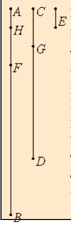

# [VII.1](https://mathcs.clarku.edu/~djoyce/java/elements/bookVII/propVII1.html)

"When two unequal numbers are set out, and the less is continually subtracted in turn from the greater, if the number which is left never measures the one before it until a unit is left, then the original numbers are relatively prime."
  

## TODO

* [ ] Be neat. On paper. In text.
* [ ] Read the guide. Note Joyce’s notational conventions e.g. formal vs informal numbers. Divides. Measures.
* [ ] Read the proposition proof. Note comments for clarification.
* [ ] Write max 3 sentence proof summary. Use EWD notation for brevity and notation practice.
* [ ] Specify. What the program does. Design. Very high level pseudo code.
* [ ] Implement on paper, in C. 
* [ ] Implement in EWD notation, on paper.
* [ ] Write down 3 test cases.
* [ ] Test on paper. Use table method.
* [ ] Implement in C on computer. Fully commented. Handle all function call errors and asserts gracefully.
* [ ] Add and run test cases on computer. Use gdb debugging if needed.
* [ ] Verify test case answers in python. Add results as comment in test.

## Guide 

TODO.

## Proof 

TODO.

## Proof Summary
Antenaresis terminates with 1. Reductio ad absurdum leads to conclusion that some number > 1 measures 1. Impossible.

## Specification and Design
Determines if the given numbers are prime to one another, a.k.a. the numbers have no common measure greater than 1. For Euclid, the unit, 1, is not a number. a.k.a. the numbers have no common divisor greater than 1. a.k.a. the numbers are relatively prime.

TODO: Design.

## Implementation in EWD notation.

On paper.

## Misc.

