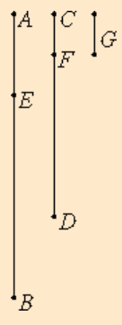

# [VII.2](https://mathcs.clarku.edu/~djoyce/java/elements/bookVII/propVII2.html)

To find the greatest common measure of two given numbers not relatively prime.

## TODO

* [ ] Be neat. On paper. In text.
* [ ] Read the guide. Note Joyce’s notational conventions e.g. formal vs informal numbers. Divides. Measures.
* [ ] Read the proposition proof. Note comments for clarification.
* [ ] Write max 3 sentence proof summary. Use EWD notation for brevity and notation practice.
* [ ] Specify. What the program does. Design. Very high level pseudo code.
* [ ] Implement in EWD notation, on paper.
* [ ] Write down 3 test cases.
* [ ] Test on paper. Use table method.
* [ ] Implement on paper, in C. 
* [ ] Implement in C on computer. Fully commented. Handle all function call errors and asserts gracefully.
* [ ] Add and run test cases on computer. Use gdb debugging if needed.
* [ ] Verify test case answers in python. Add results as comment in test.
* [ ] Check .md for typos.

## Guide 

* Foundations of number theory 

* "he assumes that if a < b, then a can be repeatedly subtracted from b until there is eventually a remainder less than or equal to a.” 

* "there are numbers than can be decreased by 1 infinitely many times but not ever reach 1.” // I think this alludes to transfinite numbers discovered by Georg Cantor.

* "an axiom is needed to exclude such behavior." 

* "assumption that the process of antenaresis eventually reaches an end when applied to numbers.” 

* "Euclid certainly knew it needn’t halt for magnitudes” // I didn't understand this :confused:.

* "One such axiom is a descending chain condition which states that there is no infinite decreasing sequence of numbers" 

## Proof 

The process used here is antenaresis again, identical to VII.1. However in the proposition we assume the two numbers are not prime to one another, therefore the final remainder will not be 1. The final remainder will be a number greater than 1. The proof shows that this final remainder is in fact the greatest common measure of the two numbers. 

* "Since then, CF measures AE, and AE measures DF, therefore CF also measures DF.”  
//  
CF|AE and AE|DF 
=> {if a first number measures a second, and the second measures a third, the first measures the third} 
CF|DF 

* "But it measures itself, therefore it also measures the whole CD.”  
//  
CF|CF and CF|DF  
=> {if a number measures two numbers, it also measures their sum} 
CF|CD 

* VII.2 Corollary proof 
    * Let A = gcm(B, C), by def. A|B and A|C 
    
    * Let some other number D < A also  
    D|B and D|C 
    
    * Conclusion D|A? <= D|X and X|A ??? 

## Proof Summary

## Specification and Design

## Implementation in EWD notation.

## Misc.

