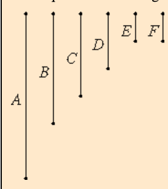

# [VII.3](https://mathcs.clarku.edu/~djoyce/java/elements/bookVII/propVII3.html)

To find the greatest common measure of three given numbers not relatively prime.

## TODO

* [x] Be neat. On paper. In text.
* [x] Read the guide. Note Joyce’s notational conventions e.g. formal vs informal numbers. Divides. Measures.
* [x] Read the proposition proof. Note comments for clarification.
* [x] Write max 3 sentence proof summary. Use EWD notation for brevity and notation practice.
* [x] Specify. What the program does. Design. Very high level pseudo code.
* [x] Implement in EWD notation, on paper.
* [x] Write down 3 test cases.
* [x] Test on paper. Use table method.
* [x] Implement on paper, in C. 
* [ ] Implement in C on computer. Fully commented. Handle all function call errors and asserts gracefully.
* [ ] Add and run test cases on computer. Use gdb debugging if needed.
* [ ] Verify test case answers in python. Add results as comment in test.
* [ ] Check .md for typos.

## Guide 

* Notation:
  * "greatest common divisor of two numbers a and b" = GCD.(a, b) = "greatest common measure" = GCM.(a, b). 

  * "a divides b" = "a measures b" = a|b 
* Euclid constructs GCD.(a, b, c) = GCD.(GCD.(a, b), c).

* Guide proof summary: 

---

\#4 Let d = GCD.(a, b) 

⇒

\#0 d|a ∧ d|b

\#7 Let e = GCD.(d, c)

⇒

\#1 e|d ∧ e|c

{\#1} e | d

{\#0} d | a

{\#0} d | b 

⇒ {transitivity of | operator}

\#2 e | a 

⇒ {transitivity of | operator}

\#3 e | b

{\#1, \#2, \#3}

⇒
 
e|a,b,c

---

* Reductio ad absurdum to prove that e is the greatest common divisor. Assume there exists a number f, greater than e, which measures a, b, c.

Let f > e ∧ f|a,b,c

⇒

\#6 f|a ∧ f|b ∧ f|c

⇒

f|a ∧ f|b

⇒ {VII.2.Corollary}

f|GCD.(a, b) 

≡ {\#4}

\#5 f|d

Therefore

⇒{\#5,\#6}

f|d ∧ f|c

⇒ {VII.2.Corollary}

f|GCD.(d, c)

≡ {\#7}

f|e

* The greater measures the less, which is **impossible**. Therefore e is the greatest common measure of a, b, c.

* Q.E.D. 

---

## Proof 

See above.

## Proof Summary

* A, B, C are not relatively prime. Take D=gcd.(A,B). 

* Case D|C. 

  * Derive D|A,B,C. Reductio add absurdum leads to conclusion D=gcd.(A,B,C). 

* Case ¬(D|C). 

 * Derive that D, C are not relatively prime. Take E=gcd.(D,C). 
 * Derive that E|A,B,C. Reduction ad absurdum leads to conclusion E=gcd.(A,B,C). 

## Specification and Design

On paper.

## Implementation in EWD notation.

On paper.

## Misc.

* Arguments relatively prime check: no pair below is relatively prime 
  * a,b 
  * a,c 
  * b,a // dup. 
  * b,c  
  * c,a // dup. 
  * c,b // dup. 

**Counting Review**

Given a,b,c
How many groups of two can we form without replacement?
choose 3, choose 2 = 3 × 2 = 6.

Let "ordering is distinguishing" mean b,a is distinct from a,b. In this case the count remains the same, 6.

Let "ordering is not distinguishing" mean b,a is the same as a,b.

In this case each group of two letters has 
choose 2 choose 1 duplicates = 2 × 1 = 2.

**In general,**
if we have n distinct letters to choose from, without replacement, in which "ordering is distinguishing (b,a!=a,b)", the number of m-tuple combinations is: = n! up to m-th term.

* e.g. 

* n = 3, m = 2, compute 3 × 2.
  * {a,b,c}. n = 3. 
  * m = 2. 
  
1. a,b
2. a,c
3. b,a
4. b,c
5. c,a
6. c,b

* n = 4, m = 2, compute 4 × 3.
  * {a,b,c,d}. n = 4. 
  * m = 2.
 
1. a,b
2. a,c
3. a,d
4. b,a
5. b,c
6. b,d
7. c,a
8. c,b
9. c,d
10. d,a
11. d,b
12. d,c
  
If we have n distinct letters to choose from, without replacement, in which "ordering is **not** distinguishing (b,a=a,b)", the number of m-tuple combinations is obtained by taking the above count and dividing by m!, i.e. dividing by the tuple length factorial.

= (n! up to m-th term)/m!

* e.g.
* n = 3, m = 2, compute (3 × 2)/2! = 6/2 = 3.
  * {a,b,c}. n = 3. 
  * m = 2. 
  
1. a,b
2. a,c
3. b,c

