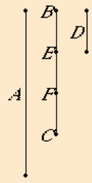

# [VII.4](https://mathcs.clarku.edu/~djoyce/java/elements/bookVII/propVII4.html)

"Any number is either a part or parts of any number, the less of the greater."

### TODO

* [x] Be neat. On paper. In text.
* [x] Read the guide. Note Joyce’s notational conventions e.g. formal vs informal numbers. Divides. Measures.
* [x] Read the proposition proof. Note comments for clarification.
* [x] Write max 3 sentence proof summary. Use EWD notation for brevity and notation practice.
* [x] Specify. What the program does. Design. Very high level pseudo code.
* [ ] Implement on paper, in C. 
  * [x] v0 
  * [ ] v1
* [ ] Implement in EWD notation, on paper.
  * [x] v0 
  * [x] v1
* [x] Write down 3 test cases.
* [ ] Test on paper. Use table method.
  * [x] v0 
  * [ ] v1
* [ ] Implement in C on computer. Fully commented. Handle all function call errors and asserts gracefully.
  * [x] v0 
  * [ ] v1
* [x] Add and run test cases on computer. Use gdb debugging if needed.
* [x] Verify test case answers in python. Add results as comment in test.

## Guide 

Modern phrasing:

For **b** < **a**, 
**b** is either a unit fraction of **a** or a proper fraction of **a**. a.k.a. part or parts.

**Example**: "2 is one part of 6, namely, one third part; but 4 is parts of 6, namely, 2 third parts of 6."

In the case ¬relatively_prime.(b, a) ∧ ¬(b|a) the proof finds the "least number of parts".

Distinction with the case relatively_prime.(b, a).

**Notation**: "b is one nth part of a as the equation b = a/n, and a statement such as b consists of m one-nth parts of a as the equation b = (m/n)a."

## Proof 

* Relavent definitions.

 * VII.Def.3. "A number is a part of a number, the less of the greater, when it measures the greater;”

 * VII.Def.4. "But parts when it does not measure it.”
 
b < a

relativelyprime.(b, a) ∨ ¬relativelyprime.(b, a)

Case relatively_prime.(b, a). Derive parts. b = (m/n)a.

Case ¬relatively_prime.(b, a) ∧ b|a. Derive part. b = a/n.

Case ¬relatively_prime.(b, a) ∧ ¬(b|a). Derive parts. b = (m/n)a.

## Proof Summary

See above.

## Specification and Design

**v0**

Determines if the lesser number is part or parts of the greater number.

Check if the given numbers are relatively prime. If yes, return parts.
Else if no, then check if b|a, if yes, return part. Else return parts.

**v1**

Same as v0 but in addition, compute m, n. See guide above.

## Implementation in EWD notation.

**subroutine measures_v1:**
// Determines how many times the number b measures the number a.
integer a, b // input.
integer d // output. 0 = ¬(b|a). > 0 (b|a) and d = a/b.

{ b > 1 ∧ a > 1 ∧ b ≤ a }

d := 0
; _do_ a ≥ b → 
  a := a - b; d := d + 1
_od_
; _if_ a = 0 → skip
⌷ ¬(a = 0) → d := 0
_fi_
**end of subroutine.**

**subroutine part_or_parts_v1:**
// Determines if the number b is part of the number a, or, if the number b is part**s** of the number a. Also computes how many if what part, in least numbers, i.e., the least numbers m and n such that a = (m/n)∙b.

integer b, a // input.
boolean p // output. p = false if b is part of a. p = true if b is parts of a.
integer m, n // output. a = (m/n)∙b, m and n are computed in least numbers.
boolean rp
integer d

{ b > 1 ∧ a > 1 ∧ b < a }

rp := relatively_prime.(b, a)
; n := measures_v1.(b, a)
; _if_ rp → p := true; m := b; n := a
⌷ ¬rp ∧ n > 0 → p := false; m := 1
⌷ ¬rp ∧ ¬(n > 0) → p := true; d := gcm.(b, a)
; m := measures_v1.(d, b); n := measures_v1.(d, a)
_fi_
**end of subroutine.**

I suck.

## Misc.

"Examples are the exclusion of goto-statements and of procedures with more than **one** output parameter. " -Dijkstra // I will try to avoid more that one output in my C code, if possible.

"If now CD measures AB, since it also measures **itself**" - VII.2 // This quote shows that the property that b|a holds in the case b = a. I use this in the implementation of measures_v0().

