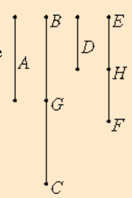

# [VII.5](https://mathcs.clarku.edu/~djoyce/java/elements/bookVII/propVII5.html)

If a number is part of a number, and another is the same part of another, then the sum is also the same part of the sum that the one is of the one.

## TODO

* [ ] Be neat. On paper. In text.
* [ ] Read the guide. Note Joyce’s notational conventions e.g. formal vs informal numbers. Divides. Measures.
* [ ] Read the proposition proof. Note comments for clarification.
* [ ] Write max 3 sentence proof summary. Use EWD notation for brevity and notation practice.
* [ ] Specify. What the program does. Design. Very high level pseudo code.
* [ ] Implement in EWD notation, on paper.
* [ ] Write down 3 test cases.
* [ ] Test on paper. Use table method.
* [ ] Implement on paper, in C. 
* [ ] Implement in C on computer. Fully commented. Handle all function call errors and asserts gracefully.
* [ ] Add and run test cases on computer. Use gdb debugging if needed.
* [ ] Verify test case answers in python. Add results as comment in test.
* [ ] Check .md for typos.

## Guide 
* "deal with **distributivity** of division and multiplication over addition and subtraction."

"
If a number a is one nth of a number b, and if d is one nth of e, then a + d is one nth of b + e. As a single algebraic equation this says

b/n + d/n = (b + d)/n.
"

If

a = (1/n)×b

d = (1/n)×e

then

a + d = (1/n)×(b + e)

Algebraically, to prove the same result as the proposition, I would have added the two equations for a + d and then factored out the common term (1/n). Hence "distributivity".

* "only stated for the sum of two numbers, it is **used** for sums of arbitrary size."
## Proof 

## Proof Summary

## Specification and Design

## Implementation in EWD notation.

## Misc.

