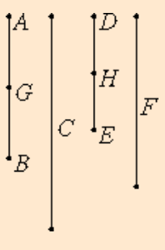

# [VII.6](https://mathcs.clarku.edu/~djoyce/java/elements/bookVII/propVII6.html)

If a number is parts of a number, and another is the same parts of another, then the sum is also the same parts of the sum that the one is of the one.



## TODO

* [ ] Be neat. On paper. In text.
* [ ] Read the guide. Note Joyce’s notational conventions e.g. formal vs informal numbers. Divides. Measures.
* [ ] Read the proposition proof. Note comments for clarification.
* [ ] Write max 3 sentence proof summary. Use EWD notation for brevity and notation practice.
* [ ] Specify. What the program does. Design. Very high level pseudo code.
* [ ] Implement in EWD notation, on paper.
* [ ] Write down 3 test cases.
* [ ] Test on paper. Use table method.
* [ ] Implement on paper, in C. 
* [ ] Implement in C on computer. Fully commented. Handle all function call errors and asserts gracefully.
* [ ] Add and run test cases on computer. Use gdb debugging if needed.
* [ ] Verify test case answers in python. Add results as comment in test.
* [ ] Check .md for typos.

## Guide

* multiplication by [non-unit] fractions distributes over addition.

* if a = (m/n)b and d = (m/n)e then a + d = (m/n)(b + e)

## Proof 

See below.

## Proof Summary

Let parts.(AB, C) = parts.(DE, F).

I say that parts.(AB + DE, C + F) = parts.(AB, C).

[Assuming AB is m, 1-n-th parts of C. We can represent this as AB = (m/n) × C. Then by hypothesis also DE = (m/n) × F.]

[Joyce's proof seems off/may have a typo, using my book's proof below]

"For since" parts.(AB, C) = parts.(DE, F)

"therefore, as many parts of C as there are in AB, so many parts of F are there also in DE."

// m × (C/n) = AB viz. m parts.

// m × (F/n) = DE

"Let AB be divided into the parts of C, namely AG, GB,"

//  m × (C/n) = AB = AG + GB

"and DE into the parts of Fm namely DH, HE;"

// m × (F/n) = DE = DH + HE

"thus the multitude of AG, GB will be equal to the multitude of DH, HE."

// multitude.(AG, GB) = 2 = multitude.(DH, HE)

"And whatever part AG is of C, the same part is DH of F also,"

// part.(AG, C) = part.(DH, F)

"therefore, whatever part AG is of C, the same part also is the sum of AG, DH of the sum of C, F. [VII.5]"

// ⇒ part.(AG, C) = part.(AG + DH, C + F)

"For the same reason, whatever part GB is of C, the same part also is the sum of GB, HE of the sum of C, F."

// ⇒ part.(GB, C) = part.(GB + HE, C + F)

"Therefore, whatever part**s** AB is of C, the same parts also is the sum of AB, DE of the sum of C, F."

// parts.(AB, C) = parts.(AB + DE, C + F)

Q.E.D.

## Specification and Design

```C
/**

  Given two pairs, returns wether or not the sum of the pairs is the same parts as each given pair.

  @param p0 The first pair.
  @param p1 The second pair.

  @retval < 0 Error.
  @retval 1 The sum of the pairs is the same parts as the given pairs.
  @retval 0 The given pairs were not the same part. Or the sum of the pairs was not the same part as the given pairs (which should be impossible).
  
**/
int
VII_6_sum_same_parts (
  PAIR p0,
  PAIR p1
  );
```

## Implementation in EWD notation.

On paper.

## Misc.

