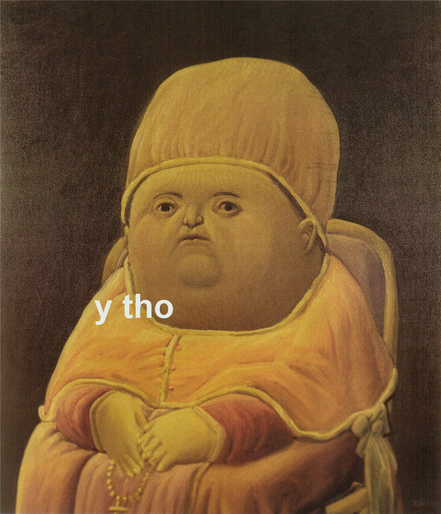

# Implementations of propositions from Euclid's Elements.

## Motivation
> "my request, my prayer so to speak is, that you stop using the term bugs for program errors, but call them what they are: errors. Unless we change our language, and call an error an error, programming and computing science have not yet matured." 

> "A study of program structure had revealed that programs —even alternative programs for the same task and with the same mathematical content— can differ tremendously in their intellectual manageability. A number of rules have been discovered, violation of which will either seriously impair or totally destroy the intellectual manageability of the program."

> "In this connection it might be worth-while to point out that the purpose of abstracting is not to be vague, but to create a new semantic level in which one can be absolutely precise." - Edsger W. Dijkstra

* [Reasoning About Programs. The triangle inequality. - Dijkstra](https://www.youtube.com/watch?v=OeiSWZs3GfI&t=42m35s)
* [The Humble Programmer - Dijkstra](https://www.youtube.com/watch?v=aADw3Z0gxeE&t=1576s)
* [Tony Hoare](https://youtu.be/kz7DfbOuvOM?t=1572)

I will use the following as a reference for the propositions:

https://mathcs.clarku.edu/~djoyce/java/elements/toc.html

# Current project status: 

Working on book VII.

