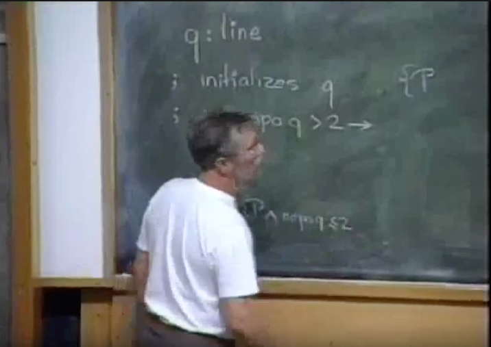
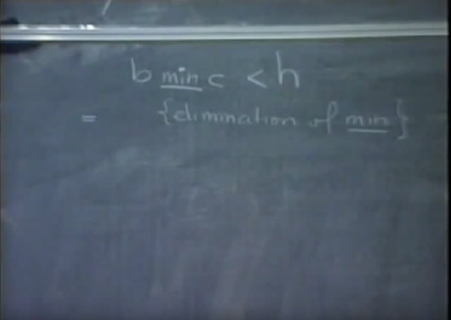

International Computers Limited

and 

The University of Newcastle Upon Tyne

Department of Computing Science

25th Joint International Seminar

on the Teaching of Computing Science

7th - 11th September 1992

[NU Lecture 2](https://www.youtube.com/watch?v=U_zcIgNNjbw&t=00m06s)

---

The problem I would like to deal with in this hour is interesting as an example of a possible interplay between mathematics and computing science, programming as a matter of fact. The history of this problem is interesting in the sense that Sylvester conjectured it in 1893, he and his contemporaries could do nothing with it. It remained dormant until 1933 when Erdüs revived interest in the problem. 


And some time later a proof was given by T. Gallai. 


I have not seen that proof but it is a proof that even Coxeter describes rather complicated. And we had to wait until 1948, until L.M. or L.N. I'm not quite sure so I omit it. Until Kelly, came, it is L.M., OK. Until L.M. Kelly came with a palatable proof. 


Now let me first state the theorem, and that is for any finite number of distinct points, in the real euclidian plane, and with real we mean that the coordinates are not complex, we can assert the following, all the points are collinear, or their exists a straight line, through exactly two of them, with exactly two I mean not three.

[Video bookmark](https://www.youtube.com/watch?v=U_zcIgNNjbw&t=02m55s)

* // BB (= BlackBoard)
  * 1893
  * 1933 Erdüs
  * 1948 L. M. Kelly
  * finite number of distinct points in the real Euclidian plane.
  * all the points are **collinear** or their exists a straight line through exactly 2 points

Now one of the things that may indicate that the theorem is possible and not completely trivial is that this is not a combinatorial theorem. You see because, oh yea sorry, for the sake of brevity, in the remaining of this hour, I will say points, I mean **distinct points**, and when I say line, I mean **straight line**.

Well the Euclidian **axiom** that connects points and lines is that any two points uniquely determine a line through them.

* // BB
  * any 2 points determine uniquely a line through them

Now let us translate the formulation of all these properties and theorems a little bit. Let us call, let us translate, points into persons, lines into clubs, a point lies on a line is that person is a member of the club.

In that case, the axiom about club membership is that any two persons uniquely determine the club of which they are a member. That's the translation of this one.


* // BB
  * any 2 persons uniquely determine the club of which they are a member

However, the conjecture of Sylvester would be that in a finite population, where this club membership rule holds, either all persons are members of the same club, or there exists a club with exactly two members.

[Video bookmark](https://www.youtube.com/watch?v=U_zcIgNNjbw&t=05m40s)

---

// 

My comment. I'm a bit confused about the statement of the theorem. As soon as you have more than one point there exists a line through exactly two of them, right? If you have 3 points on the same line and one point off that line the points are not collinear (all lie on the same line) and there exists a line through exactly two points. Can you draw a picture in which the points are not collinear and there is no line through exactly two points? 

I think I get it, as soon as we have a point that is not collinear with all the others you necessarily create a line that passes through exactly two of them. Using the translation, all persons are members of the same club or there exists a club with only two persons. Note that there may be more than a single club containing only two members.

I assume we ignore the case of a single point since no lines can be drawn. 

In the case of only two points, they are both collinear and there exists a line through exactly two of them.

The key is to focus on the existence of a line that goes through exactly two points. The theorem states that as soon as the points are not collinear we can be sure that a line through exactly two points exists.

//

---

In terms of members and clubs the theorem is not true. It is not too difficult to construct a counter example. Place a population of seven, yes, yea, place a population of seven persons in a regular fashion around a ring, 


* // BB
* 7 clubs of 3 members

and now I'm going to create seven clubs, of three members.


And I do that by putting these three members in one club. The remaining six clubs, you get by rotation of that **triangle**.

// TODO: draw the remaining six by rotation of the triangle.

Any **pair** of the complete 7 graph. The complete 7 graph has 7 times 6 over 2 is 21 edges. 

* // BB
  * 7×6/2

// My comment: I don't understand this translation of the problem.

That is, in the complete, in the population of 7 persons, you can isolate 21 pairs, each pair uniquely determines the triangle to, each edge uniquely determines the triangle to which it belongs, however you see that with these 7 clubs of 3 members it is not true that all persons belong to the same club, because each club has at most 3 members, and it is not true that there exists a club with exactly two members.

[Video bookmark](https://www.youtube.com/watch?v=U_zcIgNNjbw&t=07m41s)

So we know from this counter example that somewhere along the proof we have to use more of euclidian geometry, more properties of the euclidian plane, than just that any two points uniquely determine the line straight line through them. Now what I propose to do is to approach this problem as a programming exercise and what I shall do is show that if the given points are not collinear that then there exists a line through exactly two of those points. And I will show the existence of such a line by designing an algorithm that compute that line. 

Well, I need one function, "nopo" that is short for the "number of point on". 


We will have one variable, q, of type line. I may need a little bit more space, I will develop the program here. We have one variable q of type line. 


// My comment: Note the syntax for a variable and its type.

And what can we do with. We have to initialize that variable, now since lines are determined by two points, my proposal is that the program initializes q such that upon initialization P holds. 


And what will be P be, 


well, there is no point in considering lines that go through no points or go through one point, so we shall **initialize** q in such a way, that the number of points on q, well ideally of course its exactly two, but I cannot guarantee that, it may larger. 

// missing second conjunct, see b.4.


* // BB
  * nopo = # of points on. 
  * P : nopo.q ≥ 2

But in any case, we can confine our attention to q's that go through at least two points. So that's being done. Next is the test, 


we are now going to create a repetition, wether this q is acceptable, well, it is acceptable if the number of points on q equals 2, however if that number is larger than two, then something has to be done. 


Well upon completion of this loop, we know P, and the falsity of the guard, that is that nopo of q is at most 2, 



well, P says that nopo of q is at least 2, so hence the number of points on q equals 2 and we are done. 


Well the only thing of course is that here, as the repeatable statement, we have to **change q**, under invariance of P.


[Video bookmark](https://www.youtube.com/watch?v=U_zcIgNNjbw&t=12m15s)

---

//

// My comment: notice here again, like in "Reasoning About Programs Problem 2", Dijkstra uses the phrase "change [variable in the repeatable statement]", it is a sort of abstraction for the as yet undetermined program statements, we know that the variable's value must be change and that therefore our attention is focus next on how that variable will be changed.

// falsity of the guard = ¬(nopo.q > 2) = (nopo.q ≤ 2) = nopo.q is at most 2 = nopo of q is at most

// P = nopo.q ≥ 2 = nopo of q is at least 2.

//

---

So this is the program and it's OK and does the job, provided that we can demonstrate that this program terminates. Now, in order to prove termination of this program we might have to do two things. First of all, we might have to take into things that we didn't know, secondly, that are given but we haven't used yet, secondly, we may have to resolve some of the non-determinism,

? alia sort of vagueness

in the statement that changes q. One thing that I have omitted to point out, and that is that here, we are confining our situation to the case that the points are not collinear. 


Because that was the circumstance under which we were going to show the presence of a line q so that nopo of q equals two. The fact that the points are not collinear implies that there are at least **three** points, and therefore it's possible to initialize q such that P holds. You see because to see to it that the initial value of q is such that at least two points lie at q you need at least two points. So here we are, now we have here made a very **meager**  use of the fact that it is given that the points are not collinear, we have only used the consequence that there are at least two points. Now, question, what general conclusion can we draw with respect to q and the points from the fact that the points are not collinear?


There is a point not on q, yes. So my proposal is to take that into account by introducing a variable of type point. Variable E will be of type point, E will also be initialized, 


and the fact that the points are not collinear, I can celebrate that by seeing to it that when q goes through two points, E lies not on q.


* // BB
  * P : nopo.q ≥ 2 ∧ E lies not on q.

[Video bookmark](https://www.youtube.com/watch?v=U_zcIgNNjbw&t=16m10s)

I'm going to. The fact that this possibility, to assign to variable E a point that lies not on q, and to maintain that invariance, that is the way in which I exploit the non-linearity of the given points. Notice that the possibility to assign to E such a value is the only possible conclusion that we can directly draw from the non-linearity. That is, the maintenance of this invariant extracts out of the fact that the points are not collinear everything that can be extracted from it. Now, not surprisingly in the change of q, we will have to change E as well, 


now let us inspect a little bit what kind of freedom we have. Well, what do we know? 


Well, more than two points lie on q, so we can point to at least 3 points that lie on q. Let us name them A, B, and C, lie on q, and E lies not on q. 


And I will make a picture, I promise to you that, that will be the only picture I make. But I wait a little bit. We have to change q. Now what possibilities do we have? As it is, well I will make two pictures. q, OK, here are A, B, and C, and here is E.


The claim is that we have only three possibilities for the new value of q, and that's from E through this one [A], from E through that one [B], and from E through that one [C]. Because these four points are the only points the existence of which we can guarantee. Through two of those [A, B, C] is excluded because then we don't change q. So the new q has to go through the old E, and through one of those three. Now, the one it goes through, is, I will call, now I will rub it out, I will call A, I am free in naming here. So the new value of q, becomes the line E, A. And now I must, yah so eh, now I rub this out again, I'm going to make a new picture, this is q, and this is E, 


and I put an A here, and this will be my new q, yah.


Now, the existence of E has been used to show the, possibility of introducing E and keeping this second term of the invariant, invariant. [The invariant being "P : nopo.q ≥ 2 ∧ E lies not on q", the second term being "E lies not on q"].

Now we have to think about a termination argument. Now listen, in the original statement of the theorem we have a finite number of points, this means that our state space that consists of a q and an E, has a finite number of possible values. There is a finite number of values, possible values for q, and for each value of q there is a finite possible number of values for E. And it is in this finite space that have to find a termination argument.

[Video bookmark](https://www.youtube.com/watch?v=U_zcIgNNjbw&t=21m40s)

How do we find the termination argument? Well, the standard way is that you define a natural function on the state space which in each step of the repetition is decreased by at least 1, however, since our **space consists of a finite number of states** we can **drop** the constraint of the **variant** function being **integer**, it suffices to define an **integer [did he mean real?] function of the state** of which subsequently we can prove that it's **bounded from below** and **decreases** in each step. Now our current state **always exists** of a line q, and a point E, not on that line. Can anybody think of a **real function** of a point and a line that is bounded from below? The euclidian distance, yes, thank you very much. But if we do take the Euclidian distance, then I know which of the other two B and C, will be taken as our new E, the choice which **minimizes** the distance to the new q as much as possible. 

---

//

My comment:

"then I know which of the other two B and C, will be taken as our new E, the choice which **minimizes** the distance to the new q"

For termination, minimizing is one way to achieve decreasing steps in the repetition.

//

---

So here, we put of B and C, 


the nearest to our new q. And now, 


of the six[why 6?] possibilities that we had here, there are still three left and that is in the choice of capital A. Because the choice which new point has been settled by this. So now our only obligation is, to see to it, to prove, possibly by resolving the remaining non-determinacy, that our algorithm terminates. That is, that, the distance from E to q, actually decreases. So here we are, this was our old E and this was our old q.


And we call this distance h


And well, B is somewhere, the new distance,


the distance from B to the new q is that


And I call that little b.


---

//
My comment. Understanding the picture.

The precondition of the whole program is that "the points are not collinear. Therefore we draw a line, call it q, and we draw a point not on the like, call it E.

The guard of the repetition is "nopo.q > 2", therefore at least three points lie on q, call them A, B, C.

In changing q we have three possibilities, from E to A or B or C. Any other line like A-B would not change q.

Let the line E-A be chosen as the new q. Now we must chose which of the other points, B, C we will take as our new E. We make that choice by taking the one the minimizes the distance to the new q, i.e. we consider the distance between the new q and points B and C and the lesser becomes our new E.

In looking for a termination argument we make use of the definition of euclidian distance between a point and a line, i.e. the length of a perpendicular from a point to a line. We now consider the distance between q and E, call it h.


//

---

And I will do the same for capital C, which has a distance little c to the new q, only I don't make that drawing because that **invokes a case analysis** because there are all sorts of places where C might lie and I'm not going to do that. My **proof** obligation for the **termination** is, that I can demonstrate, that the **minimum** of little b and little c is **actually** less than h.


* //BB
  * b min c < h

And if I can show that, I have satisfied my proof obligation, [it] means that **the distance from E to q will actually decrease in each step**.

[Video bookmark](https://www.youtube.com/watch?v=U_zcIgNNjbw&t=26m18s)

Now, I have to show this, I'm going to simplify that, the very first thing is that I wish to eliminate, that operator that takes the minimum, so without changing the value of this boolean expression, I wish to **eliminate the minimum function**, 

// My comment. He calls this a function but he does not use the dot notation f.x. Instead min appears as a infix operator like x + y.



* //BB
  * b min c < h
  * = {elimination of min}


and the minimum of b and c, less than h, is according to the rules of my game, is b is less than h or c is less h.


---

// 


[Pause and think](https://www.youtube.com/watch?v=U_zcIgNNjbw&t=27m37s)

My comment. Note the long pause. Taking the time to think. Remember to really pause and think when solving a problem. No rush.

Don't forget little b and c are lines, while capital B and C are points.

//

---

Everrrybody agrees? 

* //BB
  * b min c < h
  * = {elimination of min}
  * b < h ∨ c < h

Huh? No sir, because for the termination argument I need actual decrease, so the minimum of these, of this, if this value has to be less h, then b, then b is less than h or c is less than h. And this is an equivalence because, these two boolean expressions have the same value.

// My comment. [x] TODO. Convince myself of that min equivalence.

Now, the next thing I wish to do, is to eliminate the lower case letters, obviously, obviously, because little b and h and little c, they only occur in that picture, 

// My comment: "they only occur in that picture" and do not occur in the program we are developing.

and the sooner I liberate myself from that **picture**, the better. Now, ehh, my claim is that there is a simple expression, that has the same value as b less than h. Is anybody willing to make a suggestion? The length of BA or AB, yes, is less than EA, yah, and that follows from similar **triangles**.

// My comment. EUCLID FTW!


* //BB
 * b min c < h
 * = {elimination of min}
 * b < h ∨ c < h
 * = {similar triangles}
 * BA < EA

These two triangles are similar, because they both have that right angle there and they share that one, so these two sides, the ratio of them is the same as the ratio of the hypotenuses.

[Video bookmark](https://www.youtube.com/watch?v=U_zcIgNNjbw&t=30m15s)

So BA less than EA is the one. Is that OK? Yes, apparently. Am I a little bit amazed. Well according to the rules of the game, the other condition yields me that CA less than EA

* //BB
  * b min c < h
  * = {elimination of min}
  * b < h ∨ c < h
  * = {similar triangles}
  * BA < EA ∨ CA < EA


Let me check. Will you check wether I have made an error. Yes. A, AB. Ehh, this does not hold because the space is finite. But I did make an error. I did make an error. I did make an **error**. Yes, yes, yes. There is a one bit rabbit in this proof. And I made the wrong choice, I chose, the line, but I shouldn't do that. [*Erases picture a.16*]. Here we go. This by the way was very instructive and I leave it that way. But, [*Erases the repeatable statement in the program, "q, E := ..." *]


the remark is, that I have to choose a new E, and let that be A, 


that is my new E, and now the question is will the new q go through B or will it go through C, 


so my new E becomes A and my new q becomes, of the lines sorry BC and, sorry, of the lines BE and CE the nearest to A, 

[notice in the image below that point E is assigned point A]


so and now I will have P again.

[P being the invariant of the repetition.]


Yes. No, no, no. One of the three, one of the three, now here is our drawing. Here was q, here was the old E, 


here is, my A,


here is for instance my B, 


now this, 


now I'm interested in this distance, 


the distance from A to the new q. 


Because this will be my new E.


Now we have the same picture, we call this b and we call this h


Only now it becomes a little bit different here


because b less than h is now, AB less than BE, **similarly** [Substitute C in place of B], c less than h, will be that AC less than CE.


[Video bookmark](https://www.youtube.com/watch?v=U_zcIgNNjbw&t=35m20s)

So, oops, OK. Ehh, next step, what does this follow from? Do we have a way to derive this? What does this follow from? Now have a look, if, ohh this is very funny, if x is larger than y and x prime is larger than y prime. What you are you willing to conclude? In general, x is larger than y and x prime is larger than y prime. Can you draw an obvious conclusion from that?


Yes, for instance, x plus x prime, is at least, I can even put at least here, yes. x plus x prime is at least y plus y prime. 

// My comment. Notice the slanted way he writes the \>= symbol.


Monotonicity of the addition. Write now down the **contrapositive** of this relation. x less than y or x prime less than y prime follows from x plus x prime less than y plus y prime. 

// My comment. My study of Dijkstra's Predicate Calculus and Program Semantics has paid off here. Notice how effortlessly we were able to turn the expression with a conjunction into one with a disjunction by writing down the equivalent contrapositive. 


And therefore, here you see the form of exactly this relation, and on account of monotonicity 


this follows from AB + AC is less than BE + CE. OK.


So far so good. Now listen, we will, b and c are distances, so the minimum of them is at least 0, we have to demonstrate that that minimum is less than h, we can never prove that for h is 0, so we have to take into account something, some statement of the fact that h differs from 0. Now h differs from 0, tells us because the points A, B, and C are all different, h differs from 0 tells us that A does not lie on q, but since E only occurs in connection with B and C, we now characterize the line q as the line through B and C, and h differs from 0 we now formulate as triangle E, B, C is not degenerate. But if triangle EBC is not degenerate, hence, BC is **actually** less BE plus EC. 

// My comment. Here I am lost. I don't understand what he says about h differing from 0 and triangle EBC not being degenerate.


[Video bookmark](https://www.youtube.com/watch?v=U_zcIgNNjbw&t=39m40s)

The **triangular inequality** that the sum of two sides is larger than the third side. [... audience member says something]. I don't know. I'm looking at this. And on account of monotonicity I conclude that this follows from AB plus AC is at most BC. 


Yah, from monotonicity, from this. Huh? But for this transformation replacing this by the smaller BC, I don't need to take A into account, you are rushing ahead, your conclusion is correct. Again, on account of the triangular inequality, AB plus AC is at least BC. 


Hence this is equivalent to AB plus AC equals BC.


And these are all non-negative, all positive, distances and the only way in which this can be is if A lies between B and C. So we have concluded that it is OK with A between B and C.


Of course this is the only symmetric choice so it's not surprising. But what is charming is that, that fact, is forced upon us by the calculation that shows that the minimum of little b and c is less than h. **End of proof**. 

# next 42m00s

Why is this very nice? You see, if you compare it with Kelly's proof that contains the same element, Kelly says, well, consider all, lines, and all possible combinations for q and E. All possible pairs of a line and a point not on that line. Finite collection, at least one such pair contains the **minimum** distance. And then he says well OK suppose that that, of course Kelly in 1948 proved it by a contradiction, so immediately he says, suppose that there are three points on the line q and then he derives a contradiction, we don't need to do that. Now, at the time, Kelly's introduction of the euclidian distance was greeted as a great invention, original idea that only a genius can have, because of course it is a foreign element because the problem statement itself has nothing to do with euclidian metric, its the, the theorem is a affine invariant. So it is a foreign element, but we know that given a program with a repetition we know that whereas the invariant of the repetition is uniquely determined by the program itself, the variant function, the decreasing thing that one invents to prove the termination argument, that's not determined at all, if you have some function "t" that decreases, any monotonic function of it will do it as well, of t, will do it as well. So we know, that if in arguments like that any inventiveness is required, it is at the choice of the variant function. Now I have taken extensive experiments with this problem at oral examinations and I have also shown this a number of times lecturing to an audience. At the critical moment, that the euclidian distance between q and E has to be invented. It has always been the audience that supplied this foreign body to the argument. In short, as soon as you regard this as a programming exercise, Kelly's invention becomes the most natural thing to do. So there has been progress. As final mark of progress, I would like to read to you, because it's a little bit long to write down.

[Video bookmark](https://www.youtube.com/watch?v=U_zcIgNNjbw&t=46m14s)

Sylvester's original statement of the problem. And that will give you another aspect of progress in century of mathematics.

"Prove that it is not possible to arrange any finite number of real points, so that a right line through every two of them shall pass through a third unless they all lie on the same right line."

When I tried to read that I discovered that I couldn't, there were too many negations and unless's etc. And in utter despair finally I took the concise oxford dictionary, because I now wanted to know very precisely what "unless" means. Yah, I am a modest man and I am not afraid of going to the authorities. It was very illuminating because, the COD gives two meanings for unless, one is "if-not", now "if" is a follows from, and "not" is negation, this is or.

---

//

// My comment. 
```text
"X if Y" 
= 
X ⇐ Y. // "if is a follows from"

X ⇐ Y 
= 
X ∨ ¬Y.

"X if-not Y"
=
"X if ¬Y" // "not is negation"
=
X ⇐ ¬Y
=
X ∨ ¬¬Y
=
X ∨ Y. // "this is or"

```
//

---

And the other one it gives is "except when". And if you start analyzing what "except when" means then you will come to not equivalent [≢]. So even the statement of, the theorem, is already ambiguous. Coxeter makes it worse in the sense that, he does not give, to begin with, the formulation of Sylvester, he gives his own definition, or statement of the theorem, but thereby he drops the requirement that the points are distinct, and then the theorem is false, you see, you can easily construct a counter example. OK that is what I wanted to say about how a once deep theorem, these days, is a trivial programming exercise. Any questions? "...." Yes, yes, and that is, that depends on how you, generalize distinct points. One way of defining distinctness in the plane, is that any two points uniquely determine, the line through them. The generalization for three dimensions is that any three points, uniquely determine the plane through them. And then, what you then can do is take one point, project the other points in the plane, prove the theorem in the plane, and then restore the lines in the planes again. My guess is that Coxeter has missed that generalization, because he never took the trouble of stating explicitly that the points should be distinct, or he didn't care. I mean that's the other possibility. Yes, sir. "...". Untrained mathematicians find it very difficult, no not necessarily, the program is short, I think the correctness proof simple, but what is certainly true is that in general, a program is a very compact deposit of our intellectual labors, sure. Yes, sir. "...". Yes. Yes. Real euclidian plane. Yah. Finite number of points, each point is red or blue, there exists a line that contains more than one point of homogenous color. Ahh hah, ahh hah, yeah, OK. Its not an open it is a closed problem. OK well, I might try it, tonight in bed. 

Well, thinking horizontally is a nice place. "...". No same argument. Yea, yea, well, you use this step. You may use the implication in the other sense, in which it's very common. I find, there is another comment, the way in which we have an influence by our **education**. Everybody knows the monotonicity of the addition in this form.

[Video bookmark](https://www.youtube.com/watch?v=U_zcIgNNjbw&t=54m20s)

And immediately if you suggest this, you say well what can you conclude, people come up with the sum. To do it the other way around, it's just a form that we don't know, it's logically equivalent. I find that a little bit frightening. OK. Thank you.

---

//

My comment. Reminder: Given a point and a line you can always draw a perpendicular connecting them. This is defined to be distance between a point and a line.

// a.5

//

---

---

//

My comment: 
"The fact that the points are not collinear implies that there are at least **three** points"

For, if we had only two points, they are necessarily collinear.

//

---

* // BB
* * P : nopo.q ≥ 2 ∧ E lies not on q.


```text
//v0
q : line
; initializes q {P
; do nopo.q > 2 →
  q := ... {P}
  od {P ∧ nopo.q ≤ 2, hence nopo.q = 2}
```

```
// v1
{points are not collinear}
q : line; E : point
; initializes q, E {P
; do nopo.q > 2 →
  q := ... {P}
od {P ∧ nopo.q ≤ 2, hence nopo.q = 2}
```


```
// v2
{points are not collinear}
q : line; E : point
; initializes q, E {P
; do nopo.q > 2 → {A, B, C lie on q, and E lies not on q}
  q, E  := ... {P}
od {P ∧ nopo.q ≤ 2, hence nopo.q = 2}
```

```
// v3
{points are not collinear}
q : line; E : point
; initializes q, E {P
; do nopo.q > 2 → {A, B, C lie on q, and E lies not on q}
  q, E  := "line E A", "of B and C, the nearest to our new q" {P}
od {P ∧ nopo.q ≤ 2, hence nopo.q = 2}
```

```
// v4
{points are not collinear}
q : line; E : point
; initializes q, E {P
; do nopo.q > 2 → {A, B, C lie on q, and E lies not on q}
  q, E  := "line E A",  {P}
od {P ∧ nopo.q ≤ 2, hence nopo.q = 2}
```

