# [Edsger W. Dijkstra Reasoning About Programs.](https://www.youtube.com/watch?v=OeiSWZs3GfI&t=1s)

## [Problem Two](https://www.youtube.com/watch?v=OeiSWZs3GfI&t=27m06s)

Our next example is very different. In passing it shows another form of the interplay between programming and mathematics. In this example, a mathematical theorem has to be proved. And, the theorem is an existence theorem. It tells us that a certain result exists. We shall prove that theorem by translating it into a programming exercise and writing a program of which we can demonstrate that it computes the desired result. Now if you can construct a program that computes a result, that result certainly exists. 

//p2.0

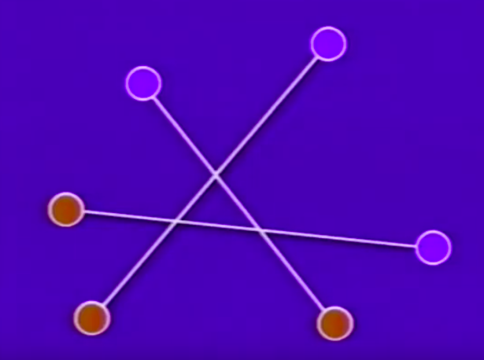

Let me explain the problem first. We are considering capital n blue points in the euclidian plane and an equal number of red points in the euclidian plane, **such that no three of them are in the same straight line**. Now that is clearly satisfied in this example. 

[Video Bookmark](https://www.youtube.com/watch?v=OeiSWZs3GfI&t=29m00s)

// my comment: "such that no three of them are in the same straight line.” Are there cases in which three points lie on the same line and the "flip operation" (explained later) does not cause the sum of the lengths to decrease? Note that in the case of three points on the same line the picture is such that the intersection is one and the same as one of the points. I was not able to come up with a picture where the sum of the lengths increases nor stays equal. One thing to note about this case is that instead of forming two triangles after the flip operation, (solid lines + dotted lines) you get one triangle and one line segment. So maybe this condition about three points is to avoid having to worry about this case in the argument.

// my comment: If four points lie on the same straight line you can draw a case in which the "flip operation” cannot remove the intersection. The lines partly overlap rather than intersect at a single point.

// my comment: Three and four point on straight line cases.

//p2.1

IMAGE TOO BIG
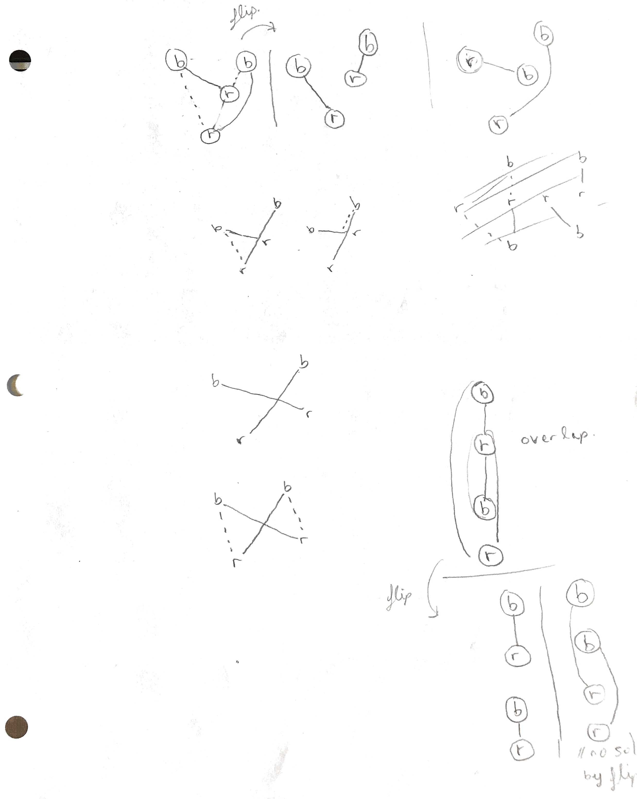

//p2.2

Furthermore the next thing to do is that we consider a one to one correspondence between the blue points and the red points, that is, we form n pairs and each pair consists of a blue one and a red one. Each blue point is coupled to a red point and vice versa. And the two points of that pair are connected by a straight line. Now the number of ways in which you can do so of course increases rapidly with the number of points. If there is one red and one blue point you don’t have any freedom at all, you can only pair them in one way. Here we have three of each and then the number of one to one correspondences between reds and blues, the number of ways in which you can pair them, is n factorial, so it's in this case six. Now the theorem to be proved is that, there exists a one to one correspondence such that none of the n line segments intersect. 

[Video Bookmark](https://www.youtube.com/watch?v=OeiSWZs3GfI&t=30m25s)

//p2.3

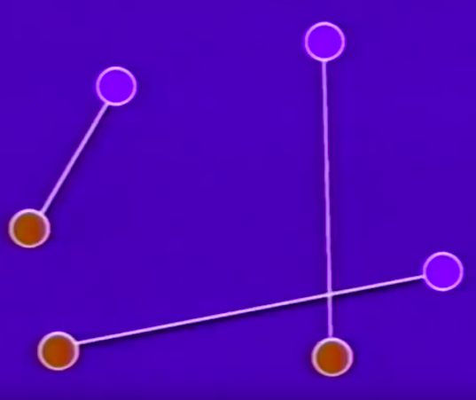

Here we have another pairing, of the same six points and here you see that there is still an intersecting pair. I think that my next slide shows a possible solution. 

[Video Bookmark](https://www.youtube.com/watch?v=OeiSWZs3GfI&t=30m50s)

//p2.4

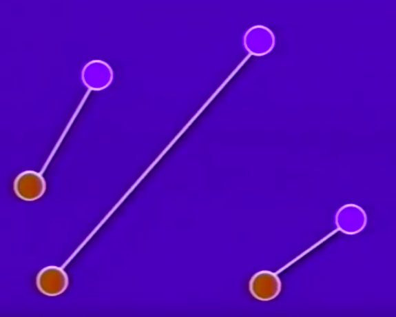

My guess is that for this situation of red and blue points this is the only solution. In general the solution is not unique. But OK, here we have a solution. The n line segments connecting the points of the pairs do not intersect. Now we have to show, that for any value of n this is true, such a solution exists. And we will do so by designing a program. 

[Video Bookmark](https://www.youtube.com/watch?v=OeiSWZs3GfI&t=31m52s)

//p2.5

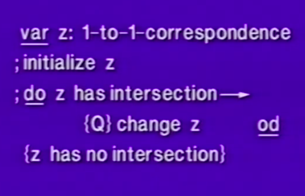

Well, we are making life very easy, we say our program operates on a single variable, the variable named z, and it is of type one to one correspondence. I should have said it is of type one to one correspondence between the given n red points and the n blue points, but that long sentence could not, didn't fit, on the single view graph. So our variable z, type one to one correspondence, it just has n factorial possible values. 

[Video Bookmark](https://www.youtube.com/watch?v=OeiSWZs3GfI&t=32m35s)

// my comment: note the use of underlining keywords like var in the above. 

// my comment: From the fact the z has “n factorial possible values” I infer that it contains a description of how the points are connected. Perhaps a data structure containing a list of all the points (n blue and n red points) and an n by n boolean matrix in which the rows represent blue points and columns represent red points. True in the matrix value means the two points are connected and false means not connected. Since we only connect pairs of blue and red points each row/column is true in only one place. Each pair of points describes a line. Given any pair of lines we can determine if they intersect. Note also that there are always just n lines.

// my comment. y = x, vs. y = x + 1. x = x + 1. 0 = 1. No solution. // y = x, y = -x. x = -x. 2x = 0. x = 0. so in general two lines f.x and g.x intersect of the equation f.x - g.x = 0 has a solution.

Each of them representing one of the n factorial one to one correspondences. Now in any program with a repetition it always starts with an initialization and then has the repetition. So the first statement is initialize z, and upon completion of that initialization z has a permissible value, that is, z represents one of the n factorial one to one correspondences. And here we have our little program, the program evaluates the boolean "z has intersection”, which is either true or false. If z has no intersection, the repetition terminates and we are done. If z has an intersection, the only thing the program has to do is to change z. Now reading this program, it’s quite clear that upon termination the value of z, is a one to one correspondence without intersections. So our only proof obligation is that, this program terminates. Well, as it stands we cannot prove that yet. You see because our program as written is a little bit nondeterministic, we have left completely open how z is initialized. And that is probably not very worrisome. What is worrisome is an incompleteness that is more serious, is that we haven’t indicated how z is going to be changed if it has an intersection. 

[Video Bookmark](https://www.youtube.com/watch?v=OeiSWZs3GfI&t=35m00s)

//p2.6

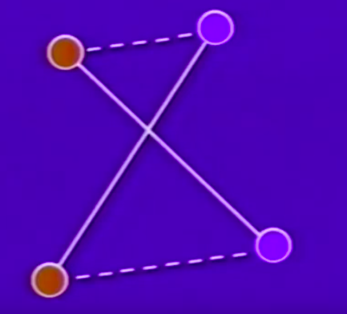

So let us investigate the situation that the statement "change z" has to cope with. Now listen, the preceding guard was "z has an intersection", so the precondition Q of the operation "change z” is z has one intersection, at least, more intersections cannot be guaranteed. So the as yet un-refined statement “change z”, has to be designed in such a way that, it copes with the situation "one intersection”. Now that is the situation we have drawn here, two red, two blue, two red-blue connections, and they intersect. Now the presence of this subfigure is the only thing we can rely on.

How can the one to one correspondence be changed? Well the only way we can do that, is changing the solid lines by the dotted lines, the red point in the left top was coupled to one of the blues ones and now has to be paired to the other blue one. So the only freedom we have is, to change those two pairings, those two connections: the operation “flip". I did not give it a name. It's the operation "flip”. 

// my comment: When Dijkstra says “only freedom” he usually means that this is the only thing we can do, hence there is no choice to be made. No heuristic guidance is required in deciding how to proceed.

I would like you to understand that in the design of that operation, we do not have, any choice, because the precondition Q only guarantees the existence of one intersecting pair of connections. Now of course we have to find a termination argument. Regrettably, we cannot argue that if we replace the solid lines by dotted lines, that then the number of intersections decreases. We have removed the one shown.

// my comment: Does the flip operation on the above figure always eliminate that particular intersection? One such case I see is that all the points lie on one and the same line. But this case in eliminated by the problem statement "such that no three of them are in the same straight line.” I will proceed under the assumption that flip always removes that one known intersection, but keep in mind that we may have created a new intersection by performing the flip operation.

But we may have introduced more. Let me give you an example. We have the situation drawn that this blue and this red were connected, and this red with the other blue. 

[Video Bookmark](https://www.youtube.com/watch?v=OeiSWZs3GfI&t=38m39s)

//p2.7

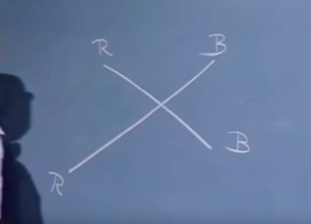

And the suggestion was to replace, to couple, this red with that blue, and that red with that blue. 

//p2.8

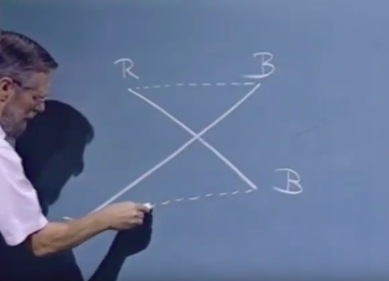

Now this intersection indeed has disappeared, 

//p2.9

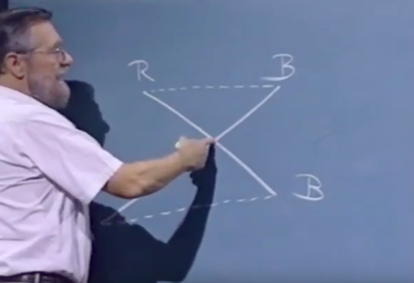

however, we don’t know, how many other pairs were here, 

//p2.10

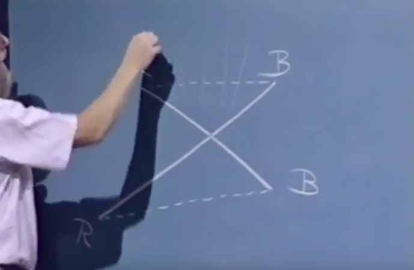

or for instance, here.

//p2.11

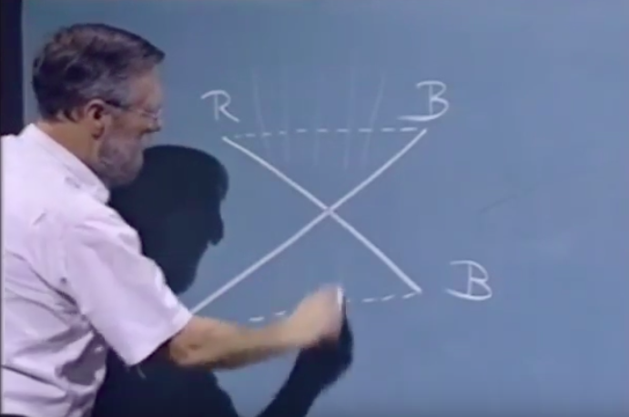

[Video Bookmark](https://www.youtube.com/watch?v=OeiSWZs3GfI&t=39m14s)

The fact that this new connection

//a.2.0

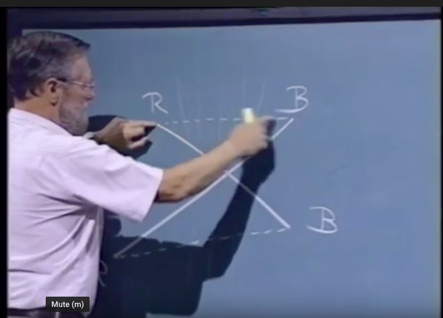

and this new connection 

//a.2.1

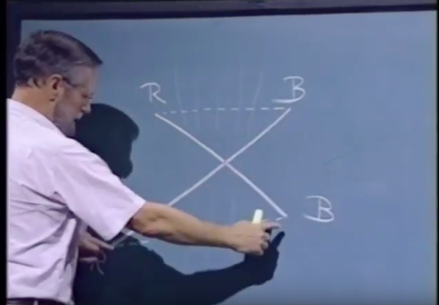

may intersect, heaven knows how many of the other intersections that we did not take into consideration, that tells us that if we are looking for a termination argument that we cannot derive it in a decrease in the number of intersections, it may actually increase, but it tells us what we have to look for. We cannot count the number of intersections, because an intersection is a result of a pair of segments, and we do not know with how many unmentioned connections our two connections interfere. And it tells us that we have to find our termination argument from, an argument that considers the connections on a more individual basis. Now there is one great advantage in this example, and the advantage is that, our state space has only a finite number of possible values. Our state space consists of the single variable z, and the single variable z has only n factorial different values. So this is a problem with a finite state space, and we can ensure termination if execution of the algorithm never revisits the same state again. 

[Video Bookmark](https://www.youtube.com/watch?v=OeiSWZs3GfI&t=41m18s)

It's never the same state in which the situation, the computation can be, ever returns [sic]. 

Now this we can guarantee if we can define some sort of function on the state, that decreases in each step. But we are now 

[Video Bookmark](https://www.youtube.com/watch?v=OeiSWZs3GfI&t=41m42s)

no longer restricted to an integer function, counting something, as we did in the previous example with the pebbles, so it is OK if we can find any real function defined on a one to one correspondence that decreases in this move. Now the interference argument tells us that this function should be built up from contributions from the individual line segments. And now if you look at it it’s quite clear what decrease is, you see, because, 

[Video Bookmark](https://www.youtube.com/watch?v=OeiSWZs3GfI&t=42m25s)

there is such a thing as the triangular inequality, in each triangle, the sum of two sides, exceeds the length of the third, 

//p2.12

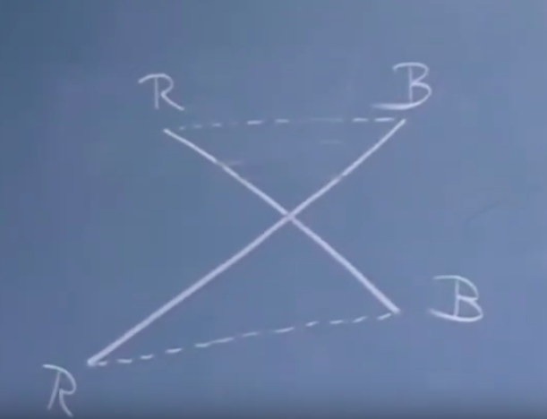

now in this triangle the length of these two lengths summed,
//p2.13

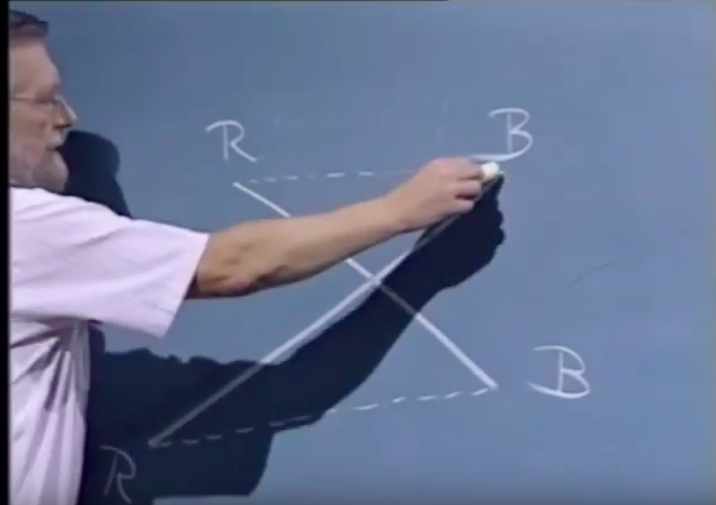

//p2.14

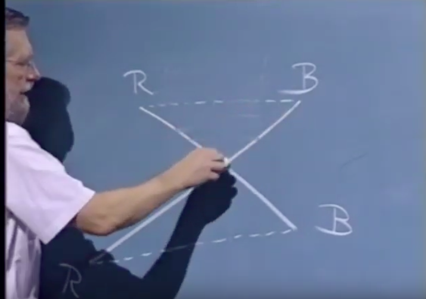

are more than that one

//p2.15

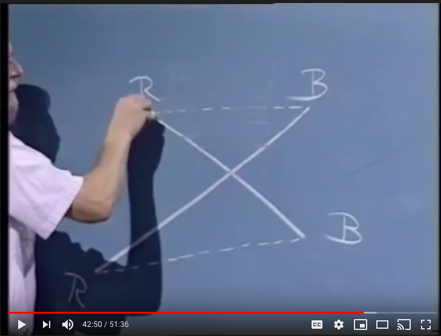

//p2.16

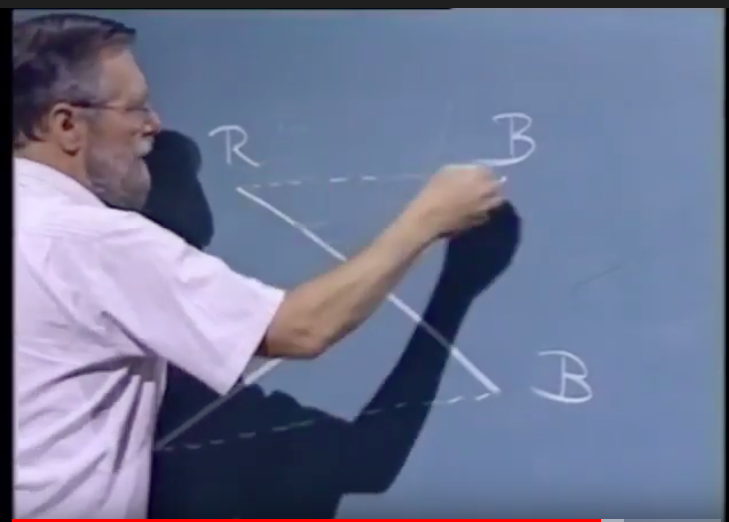

and the sum of these two lengths 

//a.2.2

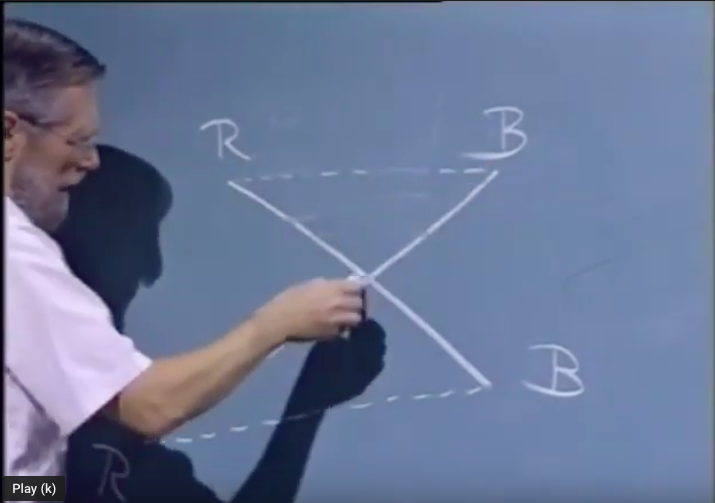

//a.2.3

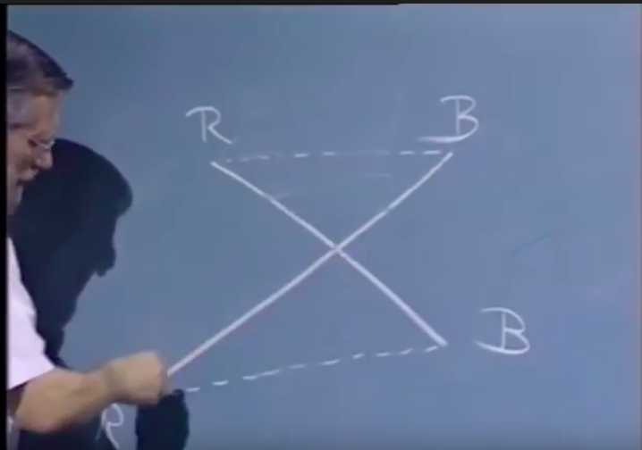

//a.2.4

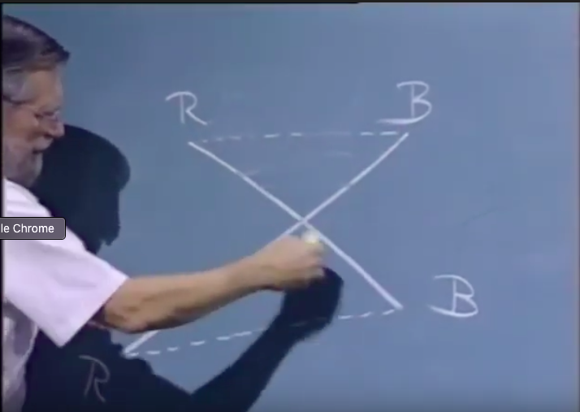

//a.2.5

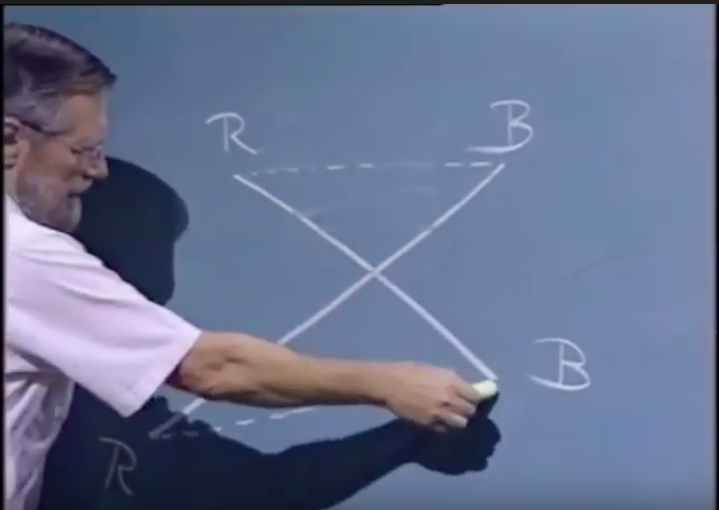

exceeds the other dotted one. 

//a.2.6

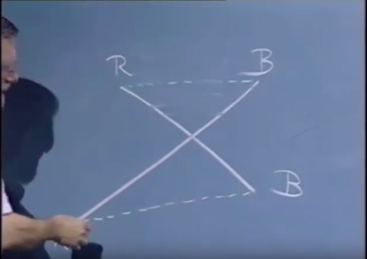

And we see that in this move, the length of, sorry, the sum of the length of these two connections, 

//p2.17

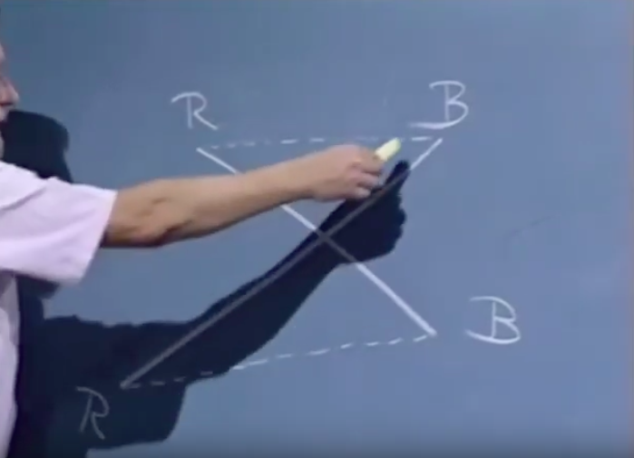

//p2.18

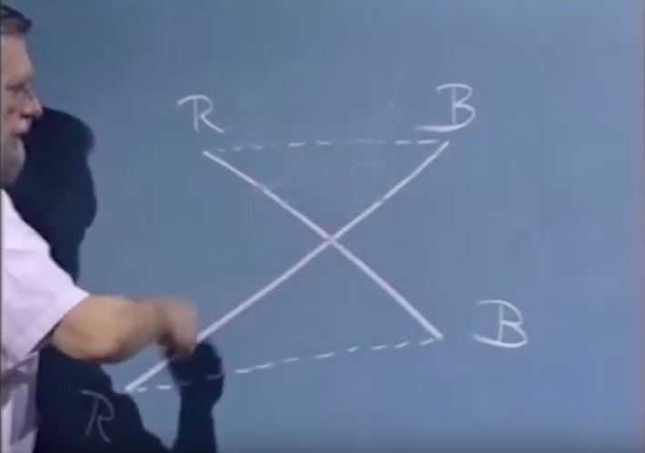

//p2.19

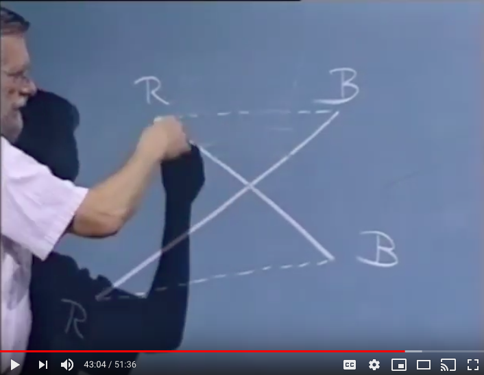

//p2.20

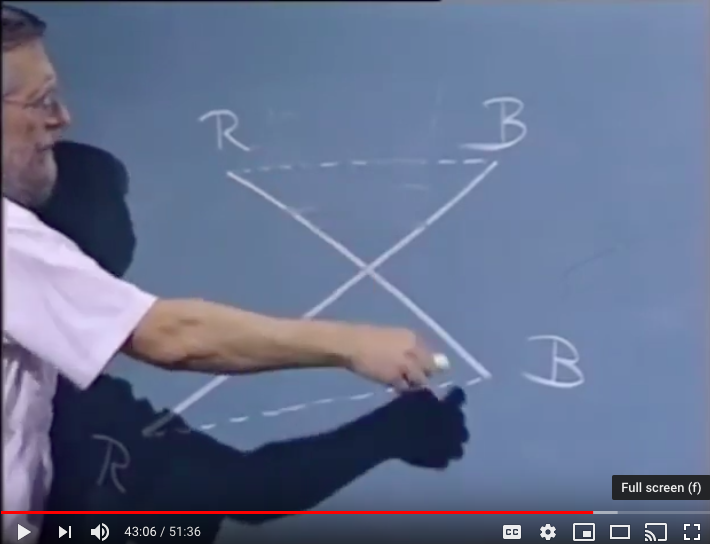

// my comment: i.e. for the upper triangle the length of the path from red to intersection to blue is greater, by the triangle inequality, than the length of the DOTTED path from red directly to blue. Same for the lower triangle. From this we can conclude also that the sum of the length of the solid pair of connections is greater than the sum of the length of the DOTTED pair of connections.

decreases. The other pairings in the one to one correspondence remaining what they are, we conclude that in the move, the sum of the lengths of the line segments decreases. And that is sufficient to demonstrate termination, and hence our program terminates, and hence our program establishes a one to one correspondence that has no intersections. 

[Video Bookmark](https://www.youtube.com/watch?v=OeiSWZs3GfI&t=43m35s)

Two final remarks about this last program. One might ask what has happened to the invariant? Capital P of the original introduction, well that’s very simple, in this example, capital P the invariant of the repetition is identically true. You see because, the invariant states, a condition that will be satisfied all through the repetition, so all states in which the invariant is false are ruled out, but thanks to the introduction of our abstract variable of type one to one correspondence that we just postulated that can have n factorial different values. The introduction of that abstract variable enabled us to introduce a state space of n factorial states in which all states are allowed, so nothing is ruled, and P can be true and hence can disappear from the argument. In a more realistic computation, the one to one correspondence would probably be represented as one of the n factorial permutations of the numbers from naught to n minus 1, or something of that sort, and you would probably use an array or sequence for that, and in that case, part of the invariant would be that, that array or sequence represents one of the permutations of the numbers from naught through n minus one. But by proper choice of the abstract type one to one correspondence, we have eliminated so to speak, the invariant P from our considerations. So much in favor of abstract programs. 

[Video Bookmark](https://www.youtube.com/watch?v=OeiSWZs3GfI&t=46m12s)

// my comment: Note the use of “abstract variable”. Recall that this is in contrast to a “primitive variable” such as an integer. Also, “abstract program”. Is this the same as Edgar Daylight's definition of “abstract program”?

Another remark to be made is, to compare this argument with how classical mathematics would formulate it. I think that the classical mathematical argument would be as follows. There is a finite number of one to one correspondences, consider now the one to one correspondences such that the sum of the lengths of the connections is minimal, and suppose that that one has a intersection. Now then comes the same argument that we had and you construct a shorter one to one correspondence, and then you have a contradiction and by a reductio ad absurdum the theorem is proved. 

I think that our argument here is preferable for two reasons. First of all, we have avoided the reductio ad absurdum and gave a completely constructive proof. Secondly, we are freed from the moral obligation that many a classical mathematician feels, and that is after he has given a proof as sketched, adds: "note that the shortest one to one correspondence need not be the only solution". In our case, we don’t need to do that because, the final value of our program can be any of the intersection free one to one correspondences. If there is another one to one correspondence, because we have left first statement initialize z completely undetermined, it could initialize z with that value and immediately the repetition terminates. So here we have a program that, for which each possible answer is possible, if I may say so. 

[Video Bookmark](https://www.youtube.com/watch?v=OeiSWZs3GfI&t=49m12s)

Now this concludes the treatment of the second example. One final request, to you, having seen how we can convince ourselves that programs indeed are totally correct. Please realize that if you have written a program, and it's not correct, it is a little bit **cowardly**, to say that your program had a bug, to call errors bugs, is a very primitive animistic attitude, suggests that the bug has a life of itself, and that you’re not totally responsible for it. That the mean little bug crept in behind your back at the moment you were not looking. This is not true, if the program is not correct, **you made an error**. And my request, my prayer so to speak is, that you stop using the term bugs for program errors, but call them what they are: errors. Unless we change our language, and call an error an error, programming and computing science have not yet matured. Thank you, for your attention.

