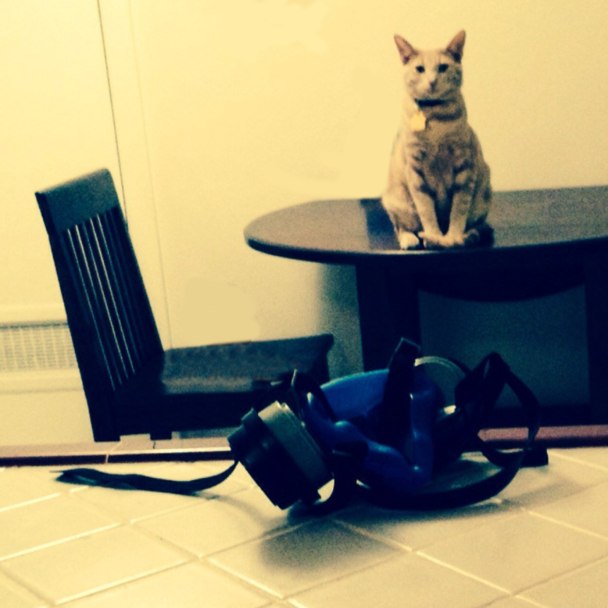

# subparprogrammer
* A portfolio of purposeless, subpar code written by me.

## [Project 8](https://github.com/darbinreyes/subparprogrammer/tree/master/textbooks/os_concepts_galvin): Operating System Concepts. Textbook problems and projects.
* Current project status: IN PROGRESS. 
* Complete programming problems and projects.

## [Project 7](https://github.com/darbinreyes/subparprogrammer/tree/master/coding_interviews): Document my solutions to coding interview questions.
* Current project status: COMPLETED. 

## Project 6: Transcribe NU lecture 1.
* Current project status: NOT STARTED. 
  * Starting after: [EWD1016](https://www.cs.utexas.edu/users/EWD/transcriptions/EWD10xx/EWD1016.html).
* Remark on silly audience semaphore question at the end.

## [Project 5](https://github.com/darbinreyes/subparprogrammer/tree/master/python_projects/ewd_reasoning_problem2): Implement in python Dijkstra's Problem 2 algorithm from Reasoning About Programs 
* Current project status: COMPLETED.

## [Project 4](https://github.com/darbinreyes/subparprogrammer/tree/master/web_projects/udemy_web_bootcamp): Complete the Udemy Web Bootcamp Course.
* Current project status: COMPLETED.

## [Project 3](https://github.com/darbinreyes/subparprogrammer/blob/master/dijkstra/youtube/nu_lecture/lecture2/nu_lecture2.md): Transcribe and take notes on Dijkstra's University of Newcastle Upon Tyne Lecture 2

* Current project status: COMPLETED. Still trying to understand the proof though.

## [Project 2](https://github.com/darbinreyes/subparprogrammer/tree/master/dijkstra/youtube/reasoning): Transcribe and take notes on "Reasoning About Programs"
* Current project status: COMPLETED.

## [Project 1](https://github.com/darbinreyes/subparprogrammer/tree/master/c_projects/euclid): Implement propositions from Euclid's Elements in C.

* Current project status: Paused. Reconsidering the utility of this.

## [Project 0](https://github.com/darbinreyes/subparprogrammer/tree/master/web_projects/darbinreyes.com): Create personal website. 

* Current project status: COMPLETED.

* See also [related](https://github.com/darbinreyes/subparprogrammer/tree/master/servers/http).
  
  

