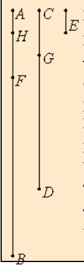

# [VII.1](https://mathcs.clarku.edu/~djoyce/java/elements/bookVII/propVII1.html)

"When two unequal numbers are set out, and the less is continually subtracted in turn from the greater, if the number which is left never measures the one before it until a unit is left, then the original numbers are relatively prime."
  

## TODO

* [x] Be neat. On paper. In text.
* [x] Read the guide. Note Joyce’s notational conventions e.g. formal vs informal numbers. Divides. Measures.
* [x] Read the proposition proof. Note comments for clarification.
* [x] Write max 3 sentence proof summary. Use EWD notation for brevity and notation practice.
* [x] Specify. What the program does. Design. Very high level pseudo code.
* [x] Implement on paper, in C. 
* [x] Implement in EWD notation, on paper.
* [x] Write down 3 test cases.
* [x] Test on paper. Use table method.
* [x] Implement in C on computer. Fully commented. Handle all function call errors and asserts gracefully.
* [x] Add and run test cases on computer. Use gdb debugging if needed.
* [x] Verify test case answers in python. Add results as comment in test.

## Guide 

VII.Def.2. By definition, a number means a "whole positive numbers greater than 1"

Antenaresis a.k.a. Euclid's Algorithm a.k.a Euclidian Algorithm.

Relationship to modern number theory.

## Proof 

Euclid’s proof is a proof by contradiction. 
Let it be given that the two given unequal numbers are prime to one another and that the antenaresis process terminates with remainder 1. 

The claim is that the numbers are therefore relatively prime, 1 alone measures both numbers. 
Next we assume the contrary, let them be measured by some number but antenaresis still terminates with remainder 1. We go through the antenaresis process with 3 iterations. An analysis of these 3 iterations leads to the conclusion that the supposed common measure measures the unit 1, which is impossible because no number greater than 1 can measure the unit 1. 

**Here is the analysis of the 3 iterations mentioned above.**

"The less of two unequal numbers AB and CD being continually subtracted from the greater, let the number which is left never measure the one before it until a unit is left." 

// Let antenaresis applied to the two numbers AB, CD terminate with remainder 1. 

"I say that AB and CD are relatively prime, that is, that a unit alone measures AB and CD." 

// We claim that therefore AB, CD are prime to one another. i.e. only 1 measures both AB, CD. 1|AB and 1|CD.  

"If AB and CD are not relatively prime, then some number E measures them."  

0- // Let E|AB and E|CD.

**iter_1.**

1- "Let CD, measuring BF, leave FA less than itself,"  

// This says let CD|BF (not that CD=BF). Therefore CD is equal to BF or some multiple of CD is equal to BF, and let FA < CD. CD = “itself". 

Algebraically: 
AB - n ∙ CD = AB - BF = FA. 

Next we consider CD, FA. CD = "the number subtracted", FA = “The remainder number". Since FA < CD, the next step should be CD - n ∙ FA. 

**iter_2.**
2- "let AF, measuring DG, leave GC less than itself" 

// Let AF|DG. Therefore AF=DG or n\*AF=DG, and let GC < AF. 

Algebraically: 

So CD - n ∙ AF = CD - DG = GC.  

Next we consider AF, GC. Since GC < AF. So the next step should be AF - n ∙ GC. 

**iter_3.**
3- "and let GC, measuring FH, leave a unit HA." 

// Let GC|FH. Therefore GC=FH or n ∙ GC=FH, and let HA=1. 

Algebraically: 

FA - n ∙ GC = FA - FH = HA, and HA = 1.  

"Since, then, E measures CD," 

// E|CD {By hypothesis 0} 

"and CD measures BF, therefore E also measures BF." 

// and CD|BF {By 1} 
⇒ {transitivity of | operator} 
E|BF. 
// E|CD ∧ CD|BF ⇒ E|BF. 

"But it also measures the whole BA, therefore it measures the remainder AF." 

// and E|BA {By 0} 
⇒ {if a number measures two numbers, it also measures the difference of the two numbers} 
Since BA-BF=AF,  
4- E|AF. 

“But AF measures DG, therefore E also measures DG." 

// and AF|DG {By 2} 
⇒ {transitivity of | operator} 
E|DG. 

"But it also measures the whole DC, therefore it also measures the remainder CG." 

// and E|DC {By 0} 
⇒ {if a number measures two numbers, it also measures the difference of the two numbers} 
E|CG. 

"But CG measures FH, therefore E also measures FH." 

// and CG|FH {By 3} 
⇒ {transitivity of | operator} 
E|FH. 

"But it also measures the whole FA, therefore it measures the remainder, the unit AH, though it is a number, which is impossible."

// and E|FA {By 4} 
⇒ {if a number measures two numbers, it also measures the difference of the two numbers} 

Since FA - FH = AH, E|AH. Here we have derived that the greater E (> 1), measures the lesser, AH (=1). This is a contradiction, therefore the claim 0 is false. 

"Therefore no number measures the numbers AB and CD. Therefore AB and CD are relatively prime. Therefore, when two unequal numbers are set out, and the less is continually subtracted in turn from the greater, if the number which is left never measures the one before it until a unit is left, then the original numbers are relatively prime." 

**Q.E.D.**

**Remarks:**

We have arrived at the unit 1 so we stop here. Since 1 measures every number, there is no point in continuing. We could consider the number GC and the unit HA, but subtracting 1 from any number always terminates at 0. 

Euclid’s proof only contains cases in which the remainder is always the lesser compared to the number subtracted. It is possible that the  number subtracted is the lesser but this doesn’t affect the correctness of the proof. 

Obviously, I will soon forget this proof, so doing this again is was not about memorization, it's just to convince myself that the program is correct. Maybe just write a long proof with comments like above only if I am unsure about the proof. 

The long length of the above proof is why EWD emphasized simplicity, convenience, and brevity in his proof format and programming notation. 

## Proof Summary

Antenaresis terminates with 1. Reductio ad absurdum leads to conclusion that some number > 1 measures 1. Impossible.

## Specification and Design

Determines if the given numbers are prime to one another, a.k.a. the numbers have no common measure greater than 1. 

For Euclid, the unit, 1, is not a number. 

prime to one another a.k.a. the numbers have no common divisor greater than 1. 

prime to one another a.k.a. the numbers are relatively prime.

The proposition specifies "two unequal numbers".

Euclid's algorithm. This is called an "antenaresis process".
Continually subtract the smaller from the greater until an unit is left. The basis of this algorithm depends on the observation that if a number measures two given numbers, it also measures their difference.

## Implementation in EWD notation.

On paper.

## Misc.

