# [Edsger W. Dijkstra Reasoning About Programs.](https://www.youtube.com/watch?v=OeiSWZs3GfI&t=1s)

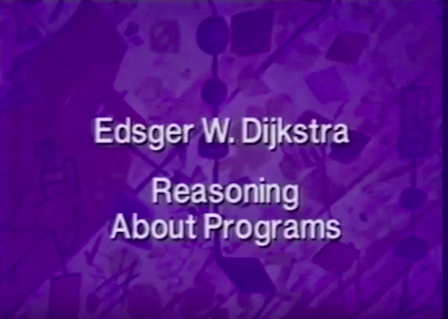

## [Problem One](https://www.youtube.com/watch?v=OeiSWZs3GfI&t=5s)

Welcome to this talk on reasoning about programs. We all know that machines are so fast and stores are so big that they give us plenty of latitude to **screw things up**.
And in order to prevent that, we have to, **prove** that our programs indeed produce the **results** we would like them to produce. This talk will have **two key themes**.

The one theme is, the **general structure of correctness arguments** about programs. The underlying theme is how to keep the **arguments as clean and as simple as possible**. **One** of the ways of achieving the latter is to **separate our concerns** as best as we can. 

One of the first **separations of concerns** we will encounter is the separation between **total correctness** and **partial correctness**. More precisely between **partial correctness** and **termination**.

Let me introduce the terms to you.

* // graphic // **“Total Correctness”** means: the program will produce the right result.

Total correctness is our final target. “Total Correctness” means that the program will produce the right result.

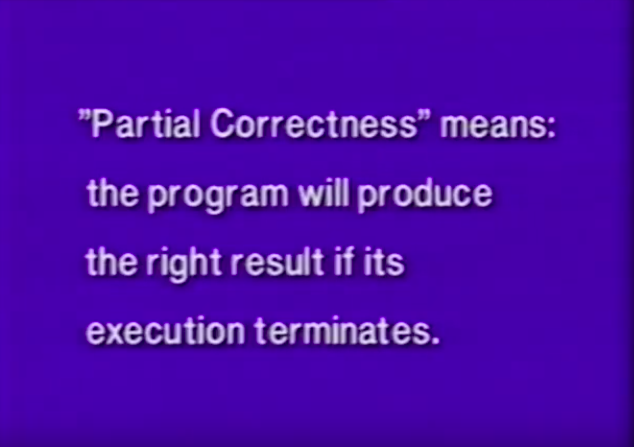

* // graphic // **“Partial Correctness”** means: the program will produce the right result **if** its execution terminates.

“Partial Correctness” is a weaker concept. It only guarantees that the program will produce the right result **if** its execution terminates. Now the introduction of the notion of partial correctness, now splits our concerns for total correctness into **two separate** ones. 

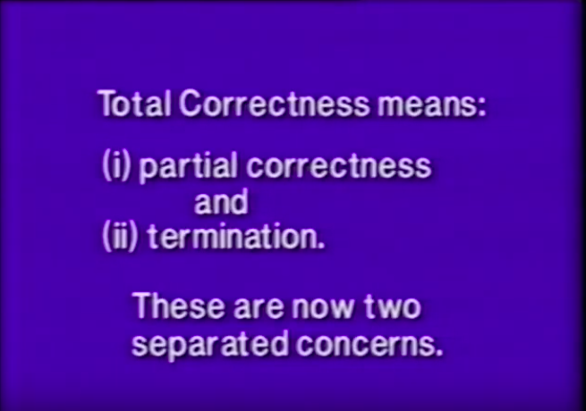

* // graphic 
* **“Total Correctness”** means: 
 * (i) partial correctness 
 * and
 * (ii) termination
 * These are now two separated concerns.

One of them is the concern for partial correctness and the other one is the concern for termination. We will see that the separation of these two concerns is **really helpful** because the considerations about partial correctness are **totally independent** of proofs of termination.

In order to show you the general structure of those **proofs**, particularly for partial correctness, let me go for a moment to the black board. I will use a notation that has been introduced by C. A. R. Hoare in the late 60’s. Let S be a program fragment, let Q be the initial condition, and let R be a post condition. 

[Video Bookmark](https://youtu.be/OeiSWZs3GfI?t=3m28s)

* //  chalkboard
 * {Q} S {R} 

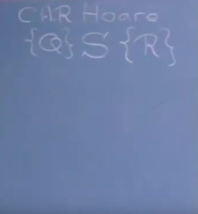

Precondition, postcondition, initial condition, final condition,  these are alternative terms. Tony Hoare introduced this to **mean** that if the initial state for the execution of the program fragment S satisfies condition Q then upon termination the program will have taken the machine into a final state that satisfies condition R. Now it is in this formalism that I will describe the general **proof rule** for a **repetitive construct**. Well the repetitive construct, I will take a very simple one, it contains of **two** things. A **boolean expression B**, saying that the repeatable statement should be executed once more, and here is the **repeatable statement**, and here is the final closing bracket "od".

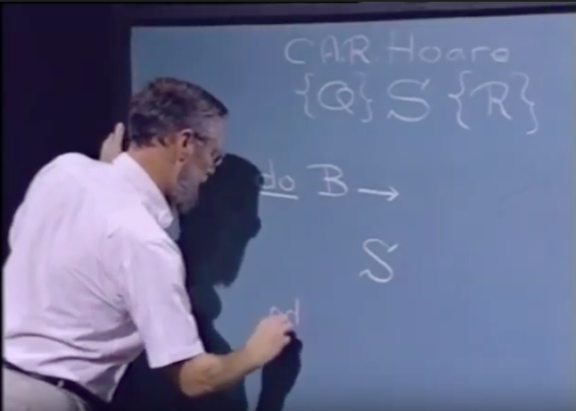

If firstly, prior to the execution of the **whole** repeatable statement, a condition P holds. 

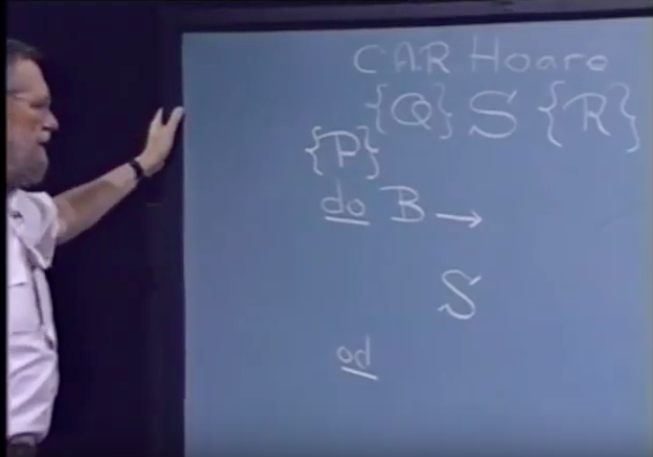

P by the way is called the **invariant**. And if S has the property that the initial validity of P **and** the guard, 

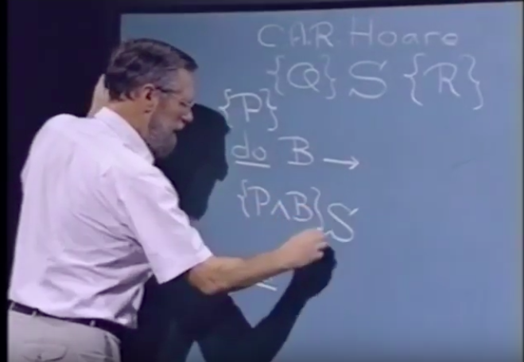

guarantees that upon completion of S, P still holds, 

well then, clearly S is such that its execution does not destroy the validity of P. 

[Video Bookmark](https://youtu.be/OeiSWZs3GfI?t=5m26s)

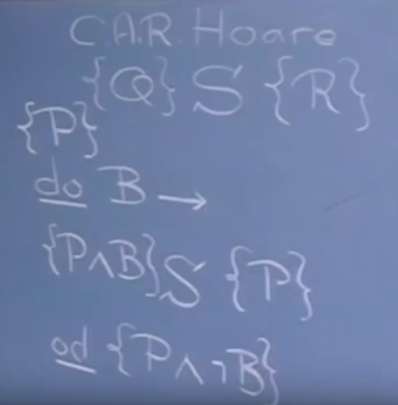 // move to after: no longer true.

* // chalkboard
  * {P} 
  * do B → 
  * {P ∧ B} S {P} 
  * od {P ∧ ¬B}

P holding at the beginning, P remains true no matter how often the statement is executed, so upon completion, P still holds, but furthermore because the repetition is terminated we know that the guard B is no longer true. Now here we have the **general pattern** that we will use **over and over again** to **prove** things about the **repetitive** construct “do B arrow S od”. P is called the **invariant**, B is called the **guard**, S is called the **statement**, and the **postcondition** is P **and** the negation of the guard. 

We shall now apply these **patterns** of reasoning to **two** different **examples**. The one of them, the first one, where the **correctness** concerns plays the major role, and the second one in which the **termination** concern plays the major role. 

For the **first example**, we shall consider a one person game, and the one person game is played with a big urn, full of pebbles, and each pebble is white or black. 

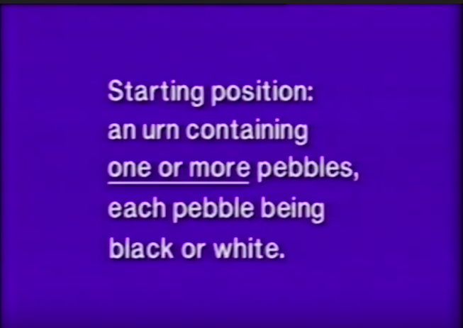

* // graphic
  * **Starting** position: an urn containing **one or more** pebbles, each pebble being black or white.

We don’t start with an empty urn. Now besides that urn with pebbles we have at our disposal as many white or black pebbles as the playing of the game might require. The game is such that a **move** is possible when there are **at least two pebbles** in the urn.

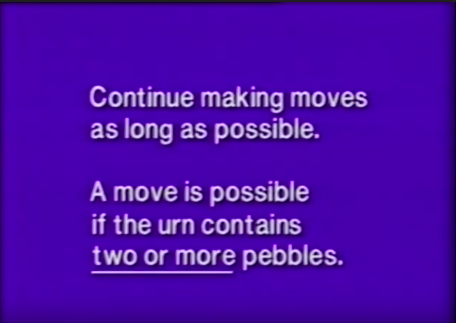

* // graphic
  * Continue making moves as long as possible. A move is possible if the urn contains **two or more pebbles**.

And as with all such one person games, the rule is that one goes on playing as long as moves are possible. Furthermore there have to be **at least two** pebbles in the urn because a move is the following:

What one does is, one shakes the urn, and then looks in the opposite direction, puts one's hand in the urn, picks up two pebbles, and looks at their color. And depending on the color of the two pebbles taken out, one puts a pebble into the urn.

[Video Bookmark](https://youtu.be/OeiSWZs3GfI?t=8m30s)

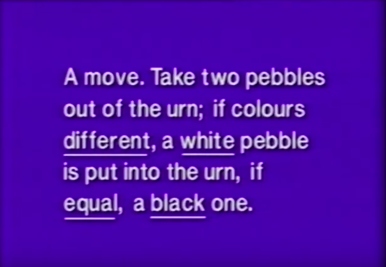

* // graphic
  * A **move**. Take two pebbles out of the urn; if colors **different**, a **white** pebble is put into the urn, if **equal**, a **black** one. 

Here are the color rules stated. They are too complicated to remember but we will return to them later. The idea is that if we take out two pebbles of different color, we put back the white one. However, if we take out two pebbles of equal color, we put a black one into the urn. Now that's precisely the reason why we need to have pebbles in store, in stock, sorry, because if you have taken out two white ones then we have to put in a black one. So we have to have a sufficient supply of black pebbles or quickly drying black paint or something of that sort. Now this is the game, not very exiting to play perhaps, but it's a worthwhile exercise to think about. 

[Video Bookmark](https://youtu.be/OeiSWZs3GfI?t=9m35s)

Now the first question is, does this game terminate?
Yes it does, you see because, we start with the urn filled with a finite number of pebbles in it, and each move, taking out two pebbles and putting in one back reduces the number of pebbles **by one**. So as the game proceeds the number of pebbles in the urn decreases, now obviously that cannot go on forever. 

So this is an example in which the termination of the process is totally trivial to determine. However, the question we are going to address now is about the final state, the final state of the urn when we can’t continue the game anymore. 

Now to begin with, that's again a separation of concerns. We could try to analyze what we can say about this game, if we totally ignore those complicated color rules, if we only capture, take into account from the move that, in each move, two pebbles are taken out, and one is turned back.

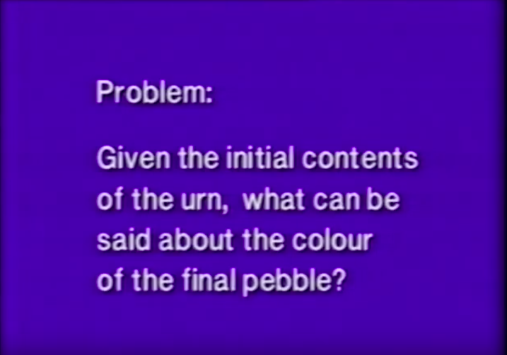

* // graphic
  * // Problem: Given the initial contents of the urn, what can be said about the color of the final pebble?

You see because our problem is, given the initial contents of the urn, what can be said about the color of the final pebble. But this is cheating already a little bit, because here the question says that there is a final pebble. One pebble left in the urn, can we **prove** that? Yes we can. You see, because, here is a description of the game being played, but totally ignoring, the colors. 

[Video Bookmark](https://youtu.be/OeiSWZs3GfI?t=12m32s)

* // graphic

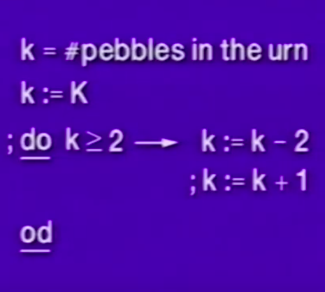

We introduce an integer variable little k and k is initialized with the number of pebbles in the urn, whatever their color. Now the first statement little k **becomes** capital k is the initialization.

And now we know that little k is at least one [ k >= 1 ] because we knew that before the game was started the urn was **non-empty**. And here are the rest of the game. There you get a repetition, and as long as there are at least two pebbles in the game, that is k at least 2 [ k >= 2 ], we get the two steps of our move. k becomes k minus 2 [ k := k - 2 ] **models** that two pebbles are taken out of the game, followed by k becomes k plus 1 [  k :=  k+1 ] modeling that a pebble is put back. Now if you combine those two things, those two steps, the **net effect** of taking out two and putting one back of course is k becomes k minus 1 [ k := k-1]. 

Now here you see the annotated program, with an annotation very much in the style as I showed on the blackboard.

[Video Bookmark](https://youtu.be/OeiSWZs3GfI?t=13m48s)

//p1.3

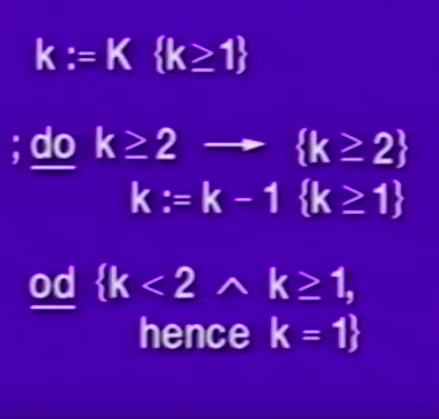

Little k becomes capital k [ k := K ], and since capital k was at least 1 [  K >= 1 ] to start with, here we have the initial condition for the repetition that little k is at least 1 [  k >=1 ]. 

Then we get the repetition, “do”, our previous guard, k at least 2 [ k >= 2 ], arrow, and at that moment we can assert the invariant P, that was that k was at least 1 [  k >= 1 ], also the guard B, that k is a least 2 [ k >= 2 ], so at that place we can assert that k is at least 2 [ k >= 2]. 

[Video Bookmark](https://youtu.be/OeiSWZs3GfI?t=14m38s)

Now obviously the precondition k at least 2 [ k >= 2 ] guarantees that after the decrease k becomes k-1 [ k := k - 1 ], k is at least 1 [ k >= 1 ]. So we see that the repeatable statement k becomes k-1 [ k := k - 1 ] nicely **maintains the truth** of k at least 1 [ k >= 1 ], so upon completion, we know two things, that the guard is false, so k is no longer at least 2, so k is less than 2 [ k < 2 ], and furthermore k is at least 1 [ k >= 1 ]. Which, has only one solution, k equal 1 [ k = 1 ]. So using the **techniques of invariance**, we have proved the simple fact that our game terminates with one pebble in the urn. So we are indeed entitled to talk about **the final pebble**. 

[Video Bookmark](https://youtu.be/OeiSWZs3GfI?t=15m51s)

Let now return to the original question, and that is, given the initial contents of the urn, what can we say about the color of the final pebble. Well, this is clearly the moment to take the **colors into account**. So it is no longer sufficient to characterize the initial contents of the urn by the total number of pebbles, obviously we must know the number of black pebbles and the number of white pebbles, so what we used to call capital k, the initial number, we will now call capital b plus capital w, for the initial numbers of blacks and whites. And there we are, little b and little w represent the number of black pebbles currently in the urn and the number of white pebbles currently in the urn.

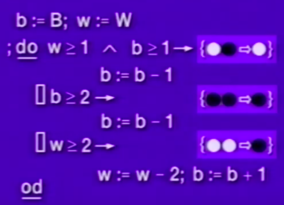

The first line of this little program represents the initialization, the initial filling of the urn, now remember our move, our move required at least 2 pebbles in the urn, you took them out, and looked at the colors. Now they could have different color, there could be a white one and a black one, when is that a **possible outcome**? Well then **initially** there was at least a white and a black one in the urn, so the condition under which we could pick up a mixed set, a white one and a black one, is that w is at least 1 and b is at least 1. Well that is the guard of the first **alternative**, you see, little w at least 1 and little b at least 1, arrow, there I have **sketched** as a reminder between braces the rule of the game, and that says that when you take out a white one and a black one, a white one is returned. And then the assignment statement b becomes b minus 1, we see the **net effect** of that move, the number of black pebbles is decreased by 1, the number of white pebbles is **unchanged**. 

[Video Bookmark](https://youtu.be/OeiSWZs3GfI?t=18m51s)

The other two guarded commands deal with cases in which two pebbles of **equal color** are taken out. If b is at least two, two black pebbles can be taken out and a black will be returned. Again the net effect on the filling of the urn is b becomes b minus 1. The complicated case, when two white pebbles are taken out, well that’s the case where we might need the black paint, because w decreases by two, and b increases by b plus 1. So here we have a description of the game that takes the changes in the filling of the number of colors in the urn into account. Now a moments inspection of these three possibilities tells us that as far as the change in the urn is concerned we **don’t need to distinguish** between the first two, they just decrease b by 1, and leave w as is. 

[Video Bookmark](https://youtu.be/OeiSWZs3GfI?t=20m15s)

The last one increases b by 1 and decreases b [ audio error: Dijkstra’s says "decreases b”, when he clearly intended to say “decreases w"] but decreases it by 2. So we see that **whatever happens**, w remains constant or w is decreased by 2. In other words, w is only decreased by 2. And that means that if w started even, it will **remain even**, if w started odd, it will **remain odd**. And I’ll show you the consequence of that on the blackboard. 

[Video Bookmark](https://youtu.be/OeiSWZs3GfI?t=21m13s)

Our original invariant for the repetition was that k was at least 1, but k is now equal to little b plus little w, so we translate that into little b plus little w is at least 1, and furthermore we have established that the parity of w does not change. That is, that even little w is equivalent to even big w.

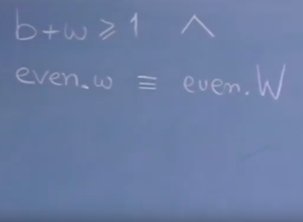

* // Blackboard
  * b + w ≥ 1 ∧ even.w ≡ even.W

And here we have **answered our problem**, you see because in the case of even [big] W, we start with an even number of **white pebbles** in the urn, it remains even, upon completion, there is only **one pebble** in the urn, and that is odd, 1 is odd. So the result is that the **final pebble is black**.

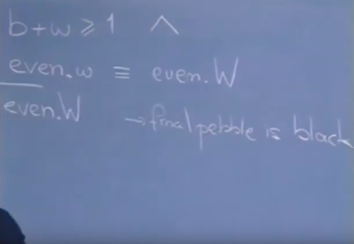

* // Blackboard
  * even.W → final pebble is black. 

In formula the **final condition** is that little w equals 0 and little b equals 1. Of course if you start with an odd number of **white ones** in the urn, then the **final pebble is white**, because the **final state** is characterized by w equals 1 and b equals 0, as these are the **only solutions** of b plus w being natural equal to 1. So this **settles the problem**: what can be said about the color of the final pebble. 

[Video Bookmark](https://youtu.be/OeiSWZs3GfI?t=23m30s)

//p1.7

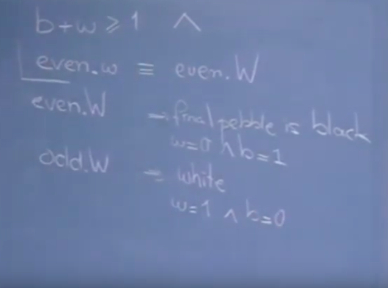

* // Blackboard
  * even.W → final pebble is black. 
      * w = 0 ∧ b = 1.
  * odd.W → white.  
      * w = 1 ∧ b = 0.

Now you may complain about this argument that the **conjunct** of the invariant, that the parity of w doesn’t change, that that is an invention which in general would be hard to make, well that complaint is to a certain extent justified, but fortunately the **designing programmer** lives in a different situation. 

He is not offered the ready made program and the rules of the game that I described to you and has to invent the invariant. In actual practice, when a programmer develops correctness proof and program hand in hand **he knows the invariant before the program has been written.**

Suppose that his task would have been the following: you are given an urn with black and white pebbles, you are requested to remove all but the last pebble from this urn. The way in which you may do that, is, you are not allowed to just turn the urn over, you have to do that very carefully, you have to do that in a series of moves, and in each move you have satisfy two constraints, the one constraint is that you have to take out 2 pebbles, and put one back in. Well there are all sorts of games with such restrictions, the famous puzzle of the missionaries and the cannibals, that have to cross a river and a little boat and the boat can contain two people and one goes back to take the boat to the other side. 

[Video Bookmark](https://youtu.be/OeiSWZs3GfI?t=25m58s)

So the rule two out one in, is not too unusual. If you now impose upon someone the constraint that he has to do this in such a way that the parity of the number of white pebbles in the urn between moves remains constant, then precisely the rules of this game will come out. And of course the rules of the game, they were the analogue of the program. Well that’s what I wanted to tell about the first example, where the termination is trivial, and the **invariant**, the **partial correctness** considerations, take the majority of the load. 

[Video Bookmark](https://youtu.be/OeiSWZs3GfI?t=27m1s)

