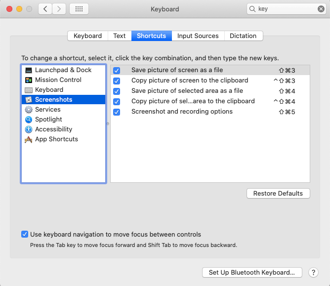

# Keyboard shortcuts to help me save time.

### Mac

Open context menu on mouse click | CTRL+click |

* Text
    * fn+DELETE | Delete character under cursor.
    * CTRL+A | Move to start of line
    * CTRL+E| Move to end of line

* Searching
    * CTRL+CMD+D | Look up in dictionary

* Mission control
    * CTRL+CMD+; | Show desktop
  

### Evernote

### Sublime Text

### UNIX terminal

From the The UNIX Programming Environment - by K&P

The UNIX system is full duplex the characters you type on the keyboard are sent to the system, which sends them back to the terminal to be printed on the screen. Normally, this echo process copies the characters directly to the screen, so you can see what you are typing, but sometimes, such as when you are typing a secret password, the echo is turned off so the characters do not appear on the screen.

Most of the keyboard characters are ordinary printing characters with no special significance, but a few tell the computer how to interpret your typing. By far the most important of these is the RETURN key. The RETURN key signifies the **end** of a **line** of input; the system **echoes** it by moving the terminal’s cursor to the beginning of the next line on the screen. RETURN must be pressed before the system will interpret the characters you have typed.

RETURN is an example of a **control character** an **invisible character** that controls some aspect of input and output **on the terminal**. On any reasonable terminal, RETURN has a key of its own, but most control characters do not. Instead, they must be typed by **holding down the CONTROL key**, sometimes called CTL or CNTL or CTRL, then pressing another key, **usually a letter**. For example, RETURN may be typed by pressing the RETURN key or, equivalently, holding down the CONTROL key and typing an ‘m’. **RETURN** might therefore be called a control-m, which we will write as **ctl- m**. Other control characters include **ctl- d**, which tells a program that there is **no more input**; **ctl-g**, which **rings** the bell on the terminal; **ctl- h**, often called **backspace**, which can be used to correct typing mistakes; and **ctl- i**, often called **tab**, which advances the cursor to the next tab stop, much as on a regular typewriter. Tab stops on UNIX systems are **eight** spaces apart. Both the **backspace** and **tab** characters have their **own keys** on most terminals.

Two other keys have special meaning: **DELETE**, sometimes called RUBOUT or some abbreviation, and **BREAK**, sometimes called **INTERRUPT**. On most UNIX systems, the **DELETE** key stops a program immediately, **without waiting for it to finish**. On some systems, **ctl-c** provides this service. And on some systems, depending on how the terminals are connected, **BREAK** is a **synonym** for **DELETE** or **ctl-c**.

You can also force a program to **dump core** by typing ctl-\ if it is running in the foreground, or by the command kill -3 if it is in the background.

* CTRL+d | EOF
* CTRL+g | 007 Bell
* CTRL+z | SIGTSTP,  Stop signal generated from keyboard, Suspends current process, use `fg` to resume it.
* CTRL+c |  SIGINT, interrupt program
* CTRL+s / CTRL+q | stop/allow output to the screen 
*        | Send kill signal
*        | Send hang up signal

### Other

