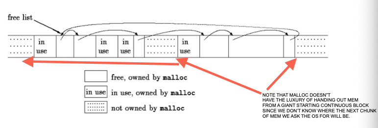
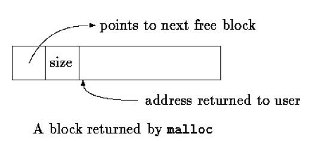

# Implementation of malloc() and free() from K&R chapter 8.7

## Example - A Storage Allocator

Calls to malloc and free may occur in any order; malloc calls upon the operating system to obtain more memory as necessary.

These routines illustrate some of the considerations involved in writing machine-dependent code in a relatively machine-independent way

Rather than allocating from a compiled-in fixed-size array, malloc will request space from the operating system as needed.

Since other activities\[?\] in the program may also request space without calling this allocator, the space that malloc manages may not be contiguous.

Thus its free storage is kept as a list of free blocks.

Each block contains a size, a pointer to the next block, and the space itself.

The blocks are kept in order of increasing storage address, and the last block (highest address) points to the first.

When a request is made, the free list is scanned until a big-enough block is found. This algorithm is called first fit, by contrast with best fit, which looks for the smallest block that will satisfy the request.

If the block is exactly the size requested it is unlinked from the list and returned to the user.

If the block is too big, it is split, and the proper amount is returned to the user while the residue remains on the free list.

If no big-enough block is found, another large chunk is obtained by the operating system and linked into the free list.

Freeing also causes a search of the free list, to find the proper place to insert the block being freed.

If the block being freed is adjacent to a free block on either side, it is coalesced with it into a single bigger block, so storage does not become too fragmented.

Determining the adjacency is easy because the free list is maintained in order of decreasing address.

One problem, which we alluded to in Chapter 5, is to ensure that the storage returned by malloc is aligned properly for the objects that will be stored in it.

Although machines vary, for each machine there is a most restrictive type: if the most restrictive type can be stored at a particular address, all other types may be also

On some machines, the most restrictive type is a double; on others, int or long suffices.

A free block contains a pointer to the next block in the chain, a record of the size of the block, and then the free space itself;

the control information at the beginning is called the "header".

To simplify alignment, all blocks are multiples of the header size,

and the header is aligned properly.

This is achieved by a union that contains the desired header structure and an instance of the most restrictive alignment type,

which we have arbitrarily made a long:

The Align field is never used; it just forces each header to be aligned on a worst-case boundary.

In malloc, the requested size in characters is rounded up to the proper number of header-sized units;

the block that will be allocated contains one more unit, for the header itself,

and this is the value recorded in the size field of the header. // i.e. size field = true size in header sized units.

The pointer returned by malloc points at the free space, not at the header itself.

The user can do anything with the space requested,

but if anything is written outside of the allocated space the list is likely to be scrambled.

The size field is necessary because the blocks controlled by malloc need not be contiguous

it is not possible to compute sizes by pointer arithmetic. // @IMPORTANT. \[Yet, it seems like we are making heavy use of pointer arithmetic in free().\]

The variable base is used to get started.

If freep is NULL, as it is at the first call of malloc, then a degenerate\[?\] free list is created; \[degenerate =\]it contains one block of size zero, and points to itself.

In any case, the free list is then **searched**.

The search for a free block of adequate size begins at the point (freep)

where the last block was found;

this strategy helps keep the list homogeneous\[?\]. // if the search always starts at the lowest memory address, then the beginning of the list will become more fragmented than the end.

If a too-big block is found, the **tail** end is returned to the user;

in this way the header of the original needs only to have its size adjusted. // tail = the part toward high memory addresses.

In all cases, the pointer returned to the user points to the free space within the block, which begins one unit beyond the header.

***

The function morecore obtains storage from the operating system.

Since asking the system for memory is a comparatively expensive operation. we don't want to do that on every call to malloc,

so morecore requests at least NALLOC units;

this larger block will be chopped up as needed.

After setting the size field, morecore inserts the additional memory into the arena **by calling free**. // so we can reuse the code that inserts a fresh block into the free list in increasing address order.

The UNIX system call sbrk(n) returns a pointer to n more bytes of storage.

sbrk returns -1 if there was no space,

The -1 must be cast to char * so it can be compared with the return value. // This is only because we saved the return value is save in a char *.

Again, casts make the function relatively immune to the details of pointer representation on different machines. // @TODO Think about this. How can pointer representation vary across machines?.

There is still one assumption, however, that pointers to **different** blocks **returned by sbrk** can be meaningfully compared. // @TODO Why not? Also see above: "it is not possible to compute sizes by pointer arithmetic."

This is not guaranteed by the standard, which permits pointer comparisons **only** within an array.

Thus this version of malloc is portable only among machines for which general pointer comparison is meaningful. // i.e. portable to machines or operating system implementations of sbrk() such that the pointer comparisons used in this code are valid.

***

\[free\] scans the free list, starting at **freep**, looking for the place to insert the free block.

This is either between two existing blocks or at the end of the list. // What about the beginning of the list? is base a considered a block?

if the block being freed is adjacent to either neighbor, the adjacent blocks are combined.

The only troubles are keeping the pointers pointing to the right things and the sizes correct.

***

Although storage allocation is intrinsically machine-dependent, the code above illustrates how the machine dependencies can be **controlled and confined** to a very small part of the program.

The use of typedef and union handles alignment (given \[assuming\] that sbrk supplies an appropriate pointer).

Casts arrange that pointer conversions are made **explicit**, and even cope with a badly-designed **system** interface.

Even though the details here are related to storage allocation, the **general approach** is applicable to other situations as well.

***

