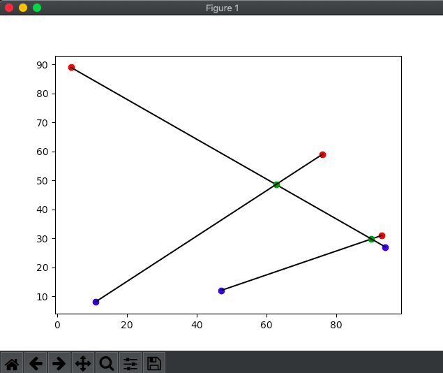
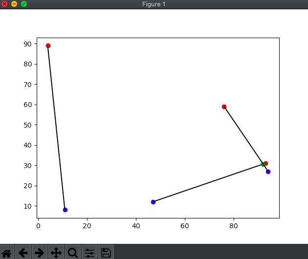
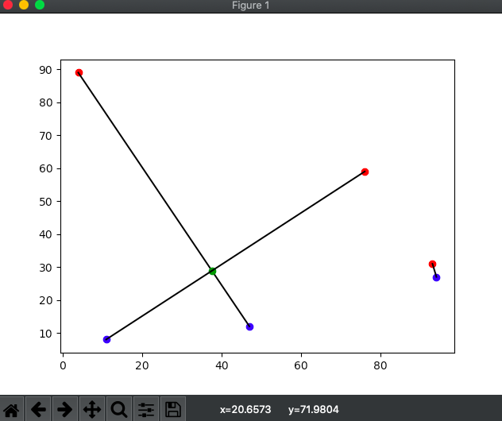
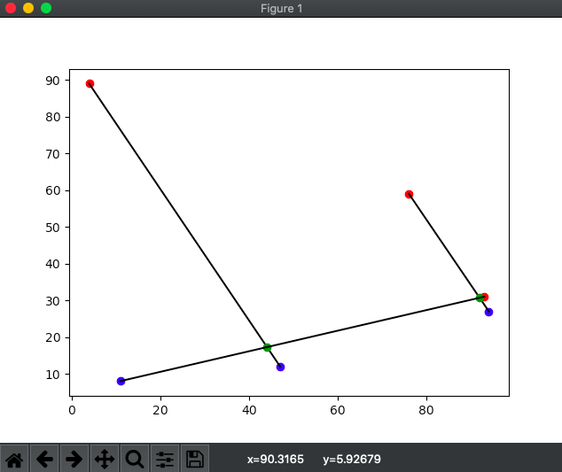
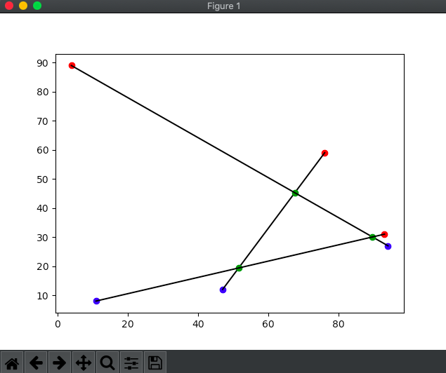
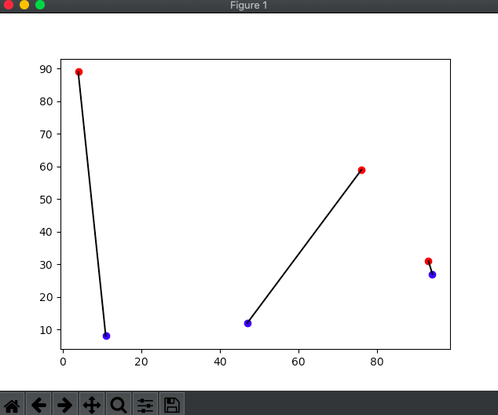
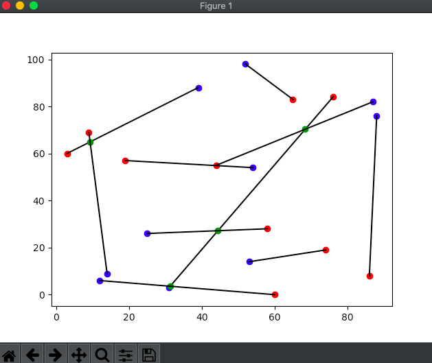
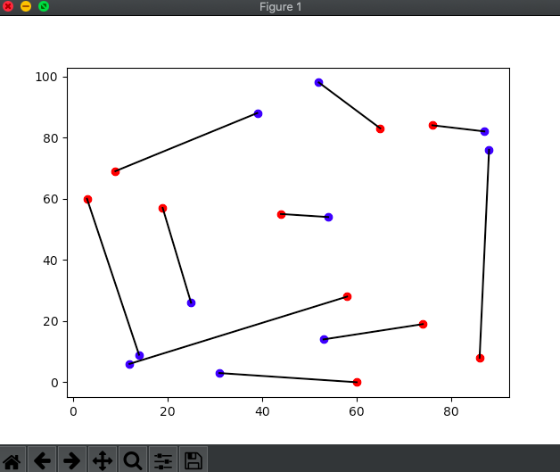

# Draft 0 README.md. // TODO: 1 2.

This directory contains my implementation of the algorithm described in Dijkstra's lecture "Reasoning About Programs". The lecture discusses two problems, this python program corresponds to the second problem: "Problem Two".

Here is a [link to the lecture](https://www.youtube.com/watch?v=OeiSWZs3GfI&t=27m06s), the link should start where the discussion of "Problem Two" begins.

See also my transcription and comments on the lecture [here.](https://github.com/darbinreyes/subparprogrammer/blob/master/Dijkstra/youtube/reasoning/problem2/Reasoning_About_Programs_Problem_2.md)

There are only two python files, reasoning_problem2_v2.py and reasoning_problem2.py. The final implementation is contained in the file reasoning_problem2_v2.py. A partial implementation is contained in reasoning_problem2.py. Understanding the partial implementation helps you understand the final implementation.
You must have the [matplotlib](https://matplotlib.org/tutorials/introductory/usage.html) python package installed to run them successfully. 

# reasoning_problem2.py

reasoning_problem2.py contains a partial implementation which I developed on the way towards the final implementation. As is, this partial implementation takes as its input a specific case of n = 3, therefore there are 3 red points and 3 blue points under consideration. The specific points are:

red points: 
(x, y) = 
(93,31) 
(4,89)
(76,59)

blue points: 
(x, y) = 
(47,12)
(94,27)
(11,8)

These points are hard-coded inside create_points(), but can be easily modified, look for the following in that function:

``` 
xcoords = [93, 4, 76, 47, 94, 11]
ycoords = [31, 89, 59, 12, 27, 8]
```

You can replace those lines with:

```
xcoords = create_coordinates(n, xmin, xmax)
ycoords = create_coordinates(n, ymin, ymax)
```

to generate a random set of points each time the script is run. The value of n, and the x/y-range of the points is hard-coded in main() but can be easily modified. If you change the value of n in main() be sure to update create_points() so that it returns 2n points (n red, n blue). 

In the main() function, first, the n red points and n blue points are generated, second, the red points are connected to the blue points according to `conn_matrix = init_conn_matrix(n)`, and finally the function `enum_conns()` plots **every** possible pairing of red and blue points, with connections indicated by straight black lines. If any intersections occur in the current plot, those intersections are marked with a green point. You must close the current plot in order to see the next plot. A total of n! plots will be displayed, hence for n = 3, 3! (= 6) plots will be displayed in succession. When no new plot window pops up, the program has terminated. Below are the plots displayed by the as is program:













# reasoning_problem2_v2.py

reasoning_problem2_v2.py contains the final implementation. The main() function is identical to that of reasoning_problem2.py up to and including the line `conn_matrix = init_conn_matrix(n)`, with the sole exception that create_points() is now generating a random set of 2n points instead of a fixed set of constant points. You can also modify the value of n in main() without having to make changes elsewhere. After the line `conn_matrix = init_conn_matrix(n)` in main(), there is a while loop which performs the operation Dijkstra calls "flip" until a pairing of red-blue connections is found which does not contain any intersections. The line `conn_swap_rows(conn_matrix, i, j)` implements the "flip" operation. The line `lines = plot_points(conn_matrix, redpts, bluepts)` plots the points and connections according to `conn_matrix` and returns a list of `FiniteLine` objects. Finally, `i, j = lines_intersect_index(lines)` searches for a pair of intersecting lines, as soon as an intersection is found, the search terminates and the intersecting lines identified by i, j are returned. If no intersection is found, `lines_intersect_index()` returns `i, j = None, None`. In this case we have found a pairing of red and blue points that does not contain any intersections, hence the program has done its job, and so it terminates. Below is the plot for an initial set of random points for n = 10, followed by the final plot containing no intersections.






