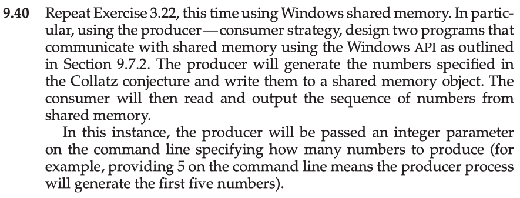

This is my solution to programming problem 9.40 from Operating System Concepts, Galvin.

Problem Statement.
===

Problem Notes.
===

I won't be solving this problem because it involves the Windows API and I only know the UNIX API. Sorry!

Solution Plan.
===

Solution Test Cases.
===

Solution Description and Results.
===

- On Mac OS X,
- To compile:
- To run:

End.
===